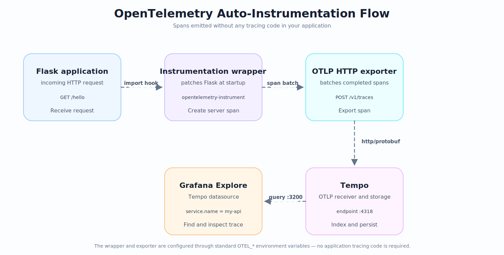

# Lab 10: Instrumenting a Python API with OpenTelemetry

**Module 55 | Observability & Distributed Tracing**

## Introduction

Manual span creation is verbose and error-prone. The OpenTelemetry project ships auto-instrumentation libraries that hook into popular frameworks such as Flask and FastAPI and emit spans automatically. This removes the need to wrap every handler with explicit tracing code.

Auto-instrumentation works by injecting bytecode at module import time. The `opentelemetry-instrument` command loads the configured instrumentations before your application starts. Each HTTP request, database call, or outbound request becomes a span with no changes to your source code.

This lab wires a Flask API into the Grafana Tempo stack from Lab 9. You install the OpenTelemetry SDK and exporter packages, configure the OTLP endpoint through environment variables, and start the API under the auto-instrumentation wrapper.

## Learning Objectives

By the end of this lab you will be able to:

- Install the OpenTelemetry distro and HTTP exporter packages.
- Bootstrap auto-instrumentation libraries for a Python web framework.
- Configure the OTLP exporter through environment variables.
- Run a Flask or FastAPI application under the auto-instrumentation wrapper.
- Verify that incoming HTTP requests appear as traces in Grafana Tempo.

### Prerequisites

- Completion of Lab 9 with the Grafana and Tempo stack running on the host.
- Python 3.10 or newer available on the host.
- A simple Flask or FastAPI application with at least one HTTP route.
- Basic familiarity with `pip` and Python virtual environments.

## Prologue

You join the same platform team from Lab 9. The tracing stack is running, but it is empty. The first microservice is a small Flask API that exposes a single endpoint. Your task is to instrument this API so every request emits a span into Tempo without modifying any application code.

You will use the OpenTelemetry auto-instrumentation wrapper, which inspects imports at startup and patches supported libraries. After you trigger one request with curl, the corresponding trace must appear in Grafana Explore.

## Environment Setup

Open a terminal on Linux, macOS, or Windows. Use any text editor or Markdown viewer to read this file side by side.

Create the lab folder and a virtual environment.

```bash
mkdir -p lab-10-otel-python-instrumentation
cd lab-10-otel-python-instrumentation
python3 -m venv .venv
source .venv/bin/activate
```

On Windows, activate the virtual environment with `.venv\Scripts\activate` instead of `source .venv/bin/activate`.

Create a small Flask application with one route.

```bash
cat > app.py <<'EOF'
from flask import Flask

app = Flask(__name__)

@app.get("/hello")
def hello():
    return {"message": "hello from instrumented api"}, 200

if __name__ == "__main__":
    app.run(host="0.0.0.0", port=5000)
EOF
```

Install Flask so the API can run.

```bash
pip install flask
```

Confirm the Grafana and Tempo stack from Lab 9 is still running.

```bash
docker compose -f ../lab-9-grafana-tempo-compose/docker-compose.yml ps
```

Both services should report `running` before you continue.

## Chapter 1: Install OpenTelemetry Packages

### Opening Context

The OpenTelemetry Python project is split into many small packages. The `opentelemetry-distro` package provides the `opentelemetry-bootstrap` and `opentelemetry-instrument` commands. The `opentelemetry-exporter-otlp-proto-http` package contains the HTTP exporter that sends spans to a Tempo OTLP receiver.

Framework instrumentations live in dedicated packages such as `opentelemetry-instrumentation-flask` or `opentelemetry-instrumentation-fastapi`. The bootstrap script detects which packages are present in your environment and prints the matching instrumentation commands.

### What You Will Build

You will install the distro package, the HTTP exporter, and the Flask instrumentation. You will then run the bootstrap command with the `-a install` flag to install every detected instrumentation library into the active environment.

### Think First

<details>
<summary>Question: Why split OpenTelemetry into many small packages instead of one large SDK?</summary>

Splitting into small packages keeps the runtime footprint minimal. An application only pays the import cost of the libraries it actually uses. A Flask app does not need to load FastAPI or gRPC instrumentation at startup.
</details>

### Implementation

Install the core packages. Fill in the first blank.

```bash
pip install opentelemetry-distro opentelemetry-exporter-otlp-proto-http ___________
```

Install the Flask instrumentation package.

```bash
pip install opentelemetry-instrumentation-flask
```

Auto-install every instrumentation library detected in the active environment. Fill in the second blank.

```bash
opentelemetry-distro ___________ install
```

<details>
<summary>Reveal answer</summary>

```bash
pip install opentelemetry-distro opentelemetry-exporter-otlp-proto-http opentelemetry-instrumentation-flask
```

```bash
opentelemetry-distro opentelemetry-bootstrap -a install
```

The first blank is `opentelemetry-instrumentation-flask`, the Flask-specific instrumentation library. The second blank is `opentelemetry-bootstrap`, the command shipped by the distro that scans the environment and installs matching instrumentation packages.
</details>

### Understanding the Code

The first command installs three packages. `opentelemetry-distro` provides the wrapper scripts. `opentelemetry-exporter-otlp-proto-http` ships the HTTP exporter that posts spans to Tempo. `opentelemetry-instrumentation-flask` patches Flask at import time so each request becomes a span.

The second command runs the bootstrap script. The `-a install` flag tells the script to invoke `pip install` for each detected instrumentation package. After it finishes, every supported library in the environment has its matching instrumentation installed.

### Matching Exercise

| Package | Function |
|---------|----------|
| opentelemetry-distro | Provides `opentelemetry-bootstrap` and `opentelemetry-instrument` |
| opentelemetry-exporter-otlp-proto-http | Sends spans over OTLP HTTP to a backend |
| opentelemetry-instrumentation-flask | Patches Flask to emit HTTP server spans |
| opentelemetry-bootstrap | Detects packages and installs their instrumentations |

<details>
<summary>Reveal answers</summary>

| Package | Function |
|---------|----------|
| opentelemetry-distro | Provides `opentelemetry-bootstrap` and `opentelemetry-instrument` |
| opentelemetry-exporter-otlp-proto-http | Sends spans over OTLP HTTP to a backend |
| opentelemetry-instrumentation-flask | Patches Flask to emit HTTP server spans |
| opentelemetry-bootstrap | Detects packages and installs their instrumentations |
</details>

### Test and Verify

List the installed OpenTelemetry packages.

```bash
pip list | grep opentelemetry
```

The output should show the distro, exporter, Flask instrumentation, and several packages installed by the bootstrap step such as `-requests`, `-urllib3`, and `-werkzeug`.

### Checkpoint

- [ ] `opentelemetry-distro` is installed.
- [ ] `opentelemetry-exporter-otlp-proto-http` is installed.
- [ ] `opentelemetry-instrumentation-flask` is installed.
- [ ] `opentelemetry-bootstrap -a install` ran without error.

## Chapter 2: Configure the OTLP Exporter

### Opening Context

The auto-instrumentation wrapper reads configuration from command-line flags and from environment variables. Environment variables are the canonical way to configure the SDK because they apply to every instrumented process and survive container restarts.

The exporter must know three things: the service name that identifies your application in the trace UI, the endpoint URL where spans should be sent, and the transport protocol used to deliver them.

### What You Will Build

You will export four environment variables before starting the API. They control the service name, the destination endpoint, the transport protocol, and the traces exporter type.

### Think First

<details>
<summary>Prediction: Which environment variable controls the destination Tempo endpoint?</summary>

The variable `OTEL_EXPORTER_OTLP_ENDPOINT` controls the destination URL. Setting it to `http://localhost:4318` points the exporter at the Tempo OTLP HTTP receiver from Lab 9. The variable is read by the OTLP exporter at startup.
</details>

### Implementation

Export the four variables. Fill in the three blanks.

```bash
export OTEL_SERVICE_NAME=my-api
export OTEL_EXPORTER_OTLP_ENDPOINT=___________
export OTEL_TRACES_EXPORTER=___________
export OTEL_EXPORTER_OTLP_PROTOCOL=___________
```

<details>
<summary>Reveal answer</summary>

```bash
export OTEL_SERVICE_NAME=my-api
export OTEL_EXPORTER_OTLP_ENDPOINT=http://localhost:4318
export OTEL_TRACES_EXPORTER=otlp
export OTEL_EXPORTER_OTLP_PROTOCOL=http/protobuf
```

The first blank is `http://localhost:4318`, the URL of the Tempo OTLP HTTP receiver from Lab 9. The second blank is `otlp`, the value that selects the OTLP traces exporter. The third blank is `http/protobuf`, the protocol that matches the Tempo HTTP receiver configuration.
</details>

### Understanding the Code

`OTEL_SERVICE_NAME` sets the `service.name` resource attribute that appears on every span from this process. `OTEL_EXPORTER_OTLP_ENDPOINT` sets the destination URL. `OTEL_TRACES_EXPORTER` selects the OTLP exporter as the trace sink. `OTEL_EXPORTER_OTLP_PROTOCOL` selects the HTTP transport with protobuf payloads, matching the Tempo receiver defined in `tempo.yml`.

### Test and Verify

Print the values to confirm they are set in the current shell.

```bash
env | grep OTEL_
```

The output should include all four variables with the values from the reveal block.

### Checkpoint

- [ ] `OTEL_SERVICE_NAME` is set to `my-api`.
- [ ] `OTEL_EXPORTER_OTLP_ENDPOINT` points to the Tempo OTLP HTTP receiver.
- [ ] `OTEL_TRACES_EXPORTER` is set to `otlp`.
- [ ] `OTEL_EXPORTER_OTLP_PROTOCOL` is set to `http/protobuf`.

## Chapter 3: Auto-Instrument and Verify Traces

### Opening Context

The `opentelemetry-instrument` command wraps your application process and injects the configured instrumentations before your code runs. Each inbound HTTP request becomes a span with attributes for method, route, and status code. The exporter forwards each finished span to the configured OTLP endpoint.

Once the wrapped process is running, sending a request with curl produces a span in Tempo. Grafana Explore then renders the trace under the service name you configured.

### What You Will Build

You will start the Flask application under the `opentelemetry-instrument` wrapper, send one request with curl, and confirm the resulting trace in Grafana Explore using the Tempo datasource from Lab 9.

<p align="center"></p>

### Think First

<details>
<summary>Question: Why use opentelemetry-instrument instead of importing OpenTelemetry in your application code?</summary>

The wrapper applies instrumentation without any code changes. It also discovers and activates every instrumentation package present in the environment, so adding a new dependency such as `requests` immediately produces outbound HTTP client spans on the next start.
</details>

### Implementation

Start the application under the wrapper. Fill in the two blanks.

```bash
___________ \
    --service_name ___________ \
    --exporter_otlp_endpoint http://localhost:4318 \
    --exporter_otlp_protocol http/protobuf \
    -- python -m flask run --host=0.0.0.0 --port=5000
```

<details>
<summary>Reveal answer</summary>

```bash
opentelemetry-instrument \
    --service_name my-api \
    --exporter_otlp_endpoint http://localhost:4318 \
    --exporter_otlp_protocol http/protobuf \
    -- python -m flask run --host=0.0.0.0 --port=5000
```

The first blank is `opentelemetry-instrument`, the wrapper command that activates every installed instrumentation before launching your application. The second blank is `my-api`, the service name that will appear on every span in Grafana Explore. The `--` separator tells the wrapper which arguments belong to your application rather than to itself.
</details>

### Understanding the Code

The wrapper reads each flag and converts it into an environment variable before exec'ing your command. `--service_name` sets `OTEL_SERVICE_NAME`. `--exporter_otlp_endpoint` sets `OTEL_EXPORTER_OTLP_ENDPOINT`. `--exporter_otlp_protocol` sets `OTEL_EXPORTER_OTLP_PROTOCOL`. The `--` separator marks the end of wrapper flags. The `python -m flask run --host=0.0.0.0 --port=5000` portion is launched after instrumentation is active.

### Test and Verify

Trigger a request to the instrumented endpoint.

```bash
curl http://localhost:5000/hello
```

The response should return the JSON payload from your Flask handler.

<details>
<summary>Prediction: Will a trace appear in Tempo if OTEL_EXPORTER_OTLP_PROTOCOL is set to grpc while Tempo only has the HTTP receiver configured?</summary>

No trace appears in Tempo. The exporter attempts a gRPC connection on port 4317, which Tempo is not listening on, so every span export fails. Either change the protocol back to `http/protobuf` and ensure the OTLP HTTP receiver is enabled in Tempo, or enable the gRPC receiver on port 4317 in `tempo.yml`.
</details>

Open Grafana at http://localhost:3000 and click the Explore icon. Choose the `Tempo` datasource. Switch the query type to `Search` and enter the service name `my-api`. Click `Run query`. The trace for the `/hello` request should appear with attributes such as `http.method=GET` and `http.route=/hello`.

### Checkpoint

- [ ] The Flask application starts under `opentelemetry-instrument`.
- [ ] `curl http://localhost:5000/hello` returns a JSON response.
- [ ] Grafana Explore lists at least one trace with service name `my-api`.

### Experiment

1. Stop the wrapped application.
2. Set the endpoint to a port where nothing is listening.

```bash
export OTEL_EXPORTER_OTLP_ENDPOINT=http://localhost:9999
```

3. Restart the application under the wrapper.
4. Trigger one request with curl.

```bash
curl http://localhost:5000/hello
```

5. Inspect the application logs. The OTLP exporter prints a connection refused error and retries on a backoff schedule.
6. Restore the correct endpoint and restart the application.

```bash
export OTEL_EXPORTER_OTLP_ENDPOINT=http://localhost:4318
```

<details>
<summary>Question: What does the OTLP exporter log when the endpoint is unreachable?</summary>

The exporter logs a connection refused error from the HTTP transport. Spans are dropped because the exporter cannot reach the destination. Restoring the correct endpoint to `http://localhost:4318` returns spans to Tempo on the next request.
</details>

## Epilogue

You installed the OpenTelemetry distro, the HTTP exporter, and the Flask instrumentation package. The bootstrap step auto-installed the remaining instrumentations for libraries already present in your environment. You then configured the exporter through environment variables that point at the Tempo OTLP HTTP receiver from Lab 9.

Running the Flask application under `opentelemetry-instrument` activated every installed instrumentation without code changes. A single curl request produced a span that appeared in Grafana Explore under the service name `my-api`. The unreachable-endpoint experiment demonstrated that the exporter logs and drops spans rather than crashing the application.

This lab covered server-side auto-instrumentation only. You did not configure custom span attributes, manual span creation, or trace sampling rules. The next lab in this module adds outbound HTTP client instrumentation so calls between microservices produce linked parent and child spans.

## The Principles

- Configure the OpenTelemetry SDK through environment variables to keep instrumentation portable.
- Use the distro wrapper to activate instrumentations without modifying application code.
- Match the exporter protocol to the backend receiver configuration to avoid silent failures.
- Treat auto-instrumentation as the baseline; add explicit spans only where the automatic data is insufficient.
- Validate the full trace path with a single test request before deploying complex configurations.

## Troubleshooting

| Problem | Likely Cause | Resolution |
|---------|--------------|------------|
| pip install reports "No matching distribution" | Python version is older than 3.10 | Upgrade Python or use a newer virtual environment |
| opentelemetry-instrument command not found | The distro package was not installed in the active venv | Run `pip install opentelemetry-distro` after activating the virtual environment |
| No traces appear in Grafana Explore | Endpoint or protocol mismatch between exporter and Tempo | Confirm `OTEL_EXPORTER_OTLP_ENDPOINT` is `http://localhost:4318` and protocol is `http/protobuf` |
| Exporter logs connection refused errors | OTLP endpoint points to a closed port | Restore the correct endpoint or open the target port on the receiver |
| Application crashes at startup | Conflicting instrumentation versions in the environment | Run `pip list | grep opentelemetry` and align all packages on the same release line |

## Next Steps

The next lab instruments an outbound HTTP call from the Flask API to a second service. You will configure the client to propagate trace context so the receiving service continues the same trace, producing a single parent and child span pair in Grafana Explore.

## Additional Resources

- https://opentelemetry.io/docs/languages/python/
- https://opentelemetry.io/docs/languages/python/automatic/
- https://opentelemetry.io/docs/specs/otel/protocol/exporter/
- https://opentelemetry-python.readthedocs.io/en/latest/exporter/otlp/otlp.html
- https://github.com/open-telemetry/opentelemetry-python-contrib/tree/main/instrumentation