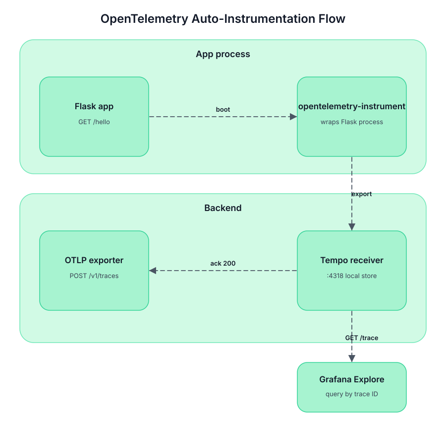
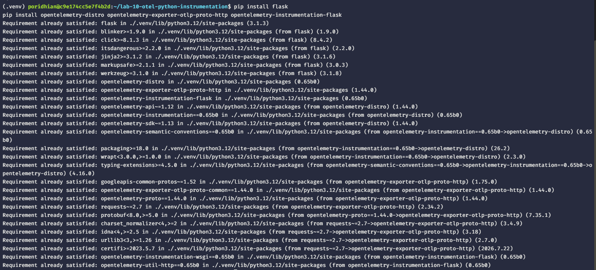
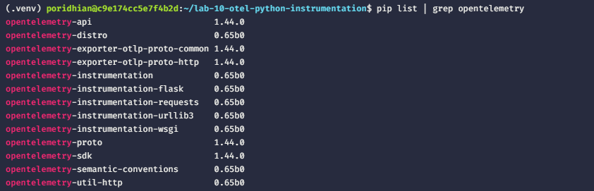

# Lab 10: Instrumenting a Python API with OpenTelemetry

Install the OpenTelemetry distro and HTTP exporter, run a Flask API under the auto-instrumentation wrapper, and see a request trace land in Grafana Tempo.



## What You Will Build

- A virtual environment with `opentelemetry-distro`, the OTLP HTTP exporter, and Flask instrumentation.
- A one-route Flask app served on port 5000.
- A wrapped launch that sends every request as a span to Lab 9's Tempo.

## Prerequisites

- Lab 9 stack running on `http://localhost:4318` and `http://localhost:3001`.
- Python 3.10 or newer with pip.
- A clean working directory on the host.

## Step 1 — Create the project and a Flask app

```bash
mkdir -p lab-10-otel-python-instrumentation
cd lab-10-otel-python-instrumentation
python3 -m venv .venv
source .venv/bin/activate
```

```bash
cat > app.py <<'EOF'
from flask import Flask

app = Flask(__name__)

@app.get("/hello")
def hello():
    return {"message": "hello from instrumented api"}, 200

if __name__ == "__main__":
    app.run(host="0.0.0.0", port=5000)
EOF
```

On Windows activate with `.venv\Scripts\activate` instead.

## Step 2 — Install Flask and the OpenTelemetry packages

```bash
pip install flask
pip install opentelemetry-distro opentelemetry-exporter-otlp-proto-http opentelemetry-instrumentation-flask
```

```bash
opentelemetry-distro opentelemetry-bootstrap -a install
```
```bash
pip list | grep opentelemetry
```


The list should include `-distro`, `-exporter-otlp-proto-http`, `-instrumentation-flask`, plus `-requests`, `-urllib3`, and `-werkzeug` from the bootstrap step.

## Step 3 — Configure the OTLP exporter

```bash
export OTEL_SERVICE_NAME=my-api
export OTEL_EXPORTER_OTLP_ENDPOINT=http://localhost:4318
export OTEL_TRACES_EXPORTER=otlp
export OTEL_EXPORTER_OTLP_PROTOCOL=http/protobuf
```
```bash
env | grep OTEL_
```


Four lines should print with the values above. `OTEL_SERVICE_NAME` sets the `service.name` resource attribute that Tempo will display.

## Step 4 — Run the app under the wrapper

```bash
opentelemetry-instrument \
    --service_name my-api \
    --exporter_otlp_endpoint http://localhost:4318 \
    --exporter_otlp_protocol http/protobuf \
    -- python -m flask run --host=0.0.0.0 --port=5000
```

The wrapper injects bytecode at import time so every Flask request becomes a span.

## Step 5 — Send one request

```bash
curl http://localhost:5000/hello
```


The JSON payload from the Flask handler should return. The wrapper has already exported the matching span to Tempo.

## Step 6 — View the trace in Grafana

Open `http://localhost:3001`, choose Explore, select the `Tempo` datasource, switch to **Search**, enter `my-api`, and click **Run query**.


The trace for `/hello` should appear with attributes such as `http.method=GET` and `http.route=/hello`.

## Checkpoint

- [ ] `env | grep OTEL_` shows all four variables.
- [ ] The wrapped Flask process is running on port 5000.
- [ ] `curl /hello` returns the JSON response.
- [ ] Grafana Explore lists at least one trace for service `my-api`.

## Next Steps

Stop the wrapped process with `Ctrl+C` when you finish. Lab 11 adds manual spans with `tracer.start_as_current_span` and custom attributes.