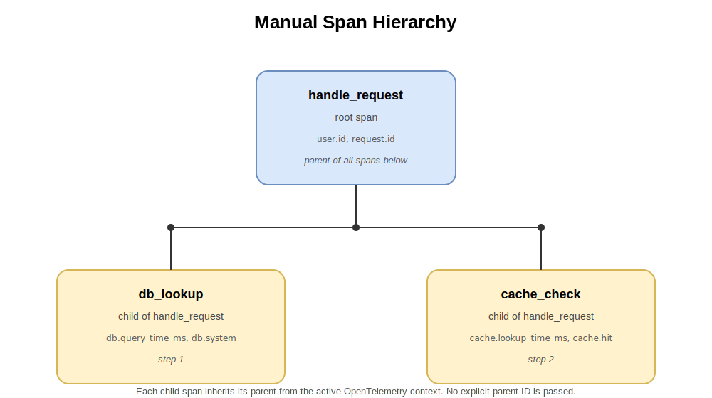
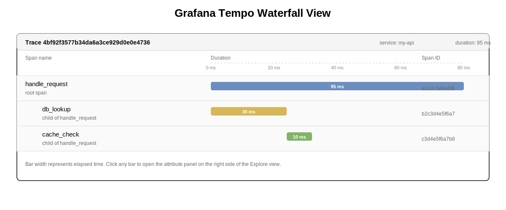
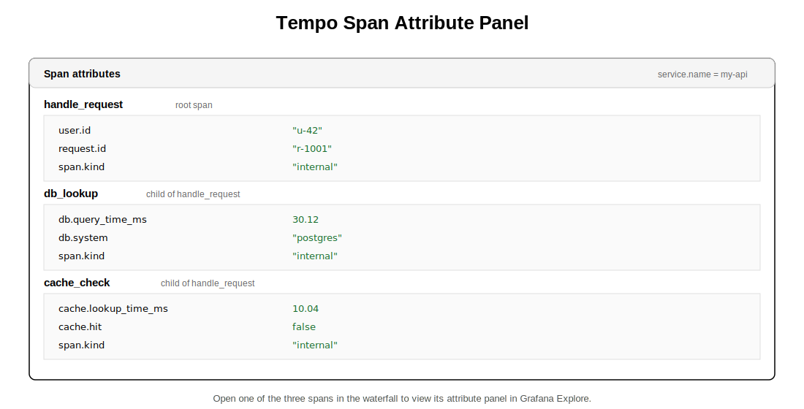

# Lab 11: Adding Manual Spans and Custom Attributes

**Module 56 | Observability & Distributed Tracing**

## Introduction

Auto-instrumentation captures framework-level activity such as HTTP handlers and database calls. It cannot describe domain-specific work such as a multi-step business workflow. Manual spans fill that gap by letting application code declare exactly which units of work matter.

Custom span attributes carry business context such as user IDs, request IDs, or measured durations. They turn a generic trace into a queryable record that answers questions like "how long does the cache lookup take for tenant X" or "which users triggered the slowest requests last hour".

This lab extends the Flask API from Lab 10 with manual spans. You create a root span for the request handler, add nested child spans for a database lookup and a cache check, and attach custom attributes to each span. You then observe the resulting hierarchy and attribute panel in Grafana Tempo.

## Learning Objectives

By the end of this lab you will be able to:

- Obtain a tracer and create a root span with the `start_as_current_span` context manager.
- Attach custom business attributes to a span through `set_attribute`.
- Create nested child spans that inherit the active context from their parent.
- Read the span hierarchy as a waterfall in Grafana Tempo.
- Diagnose broken parent-child relationships caused by incorrect span activation.

### Prerequisites

- Completion of Lab 9 with the Grafana and Tempo stack running.
- Completion of Lab 10 with the Flask API instrumented under `opentelemetry-instrument`.
- A Python 3.10 or newer virtual environment with `opentelemetry-distro` and `opentelemetry-instrumentation-flask` installed.
- Familiarity with Python context managers and the `with` statement.

## Prologue

The team from Labs 9 and 10 now wants to know what happens inside each request. Auto-instrumentation records that the Flask route ran, but it does not show how long the database lookup took or whether the cache answered the request. Without that information, performance regressions slip through unnoticed.

Your task is to wrap the handler logic in a manually created span, add child spans for the database and cache steps, and record business attributes on each span. After triggering a request, the trace must appear in Grafana Tempo with a clear parent-child waterfall and a populated attribute panel.

## Environment Setup

Open a terminal on Linux, macOS, or Windows. Use any text editor or Markdown viewer to read this file side by side.

Reuse the project from Lab 10 by copying it forward and re-entering the virtual environment.

```bash
cp -r lab-10-otel-python-instrumentation lab-11-manual-spans
cd lab-11-manual-spans
source .venv/bin/activate
```

On Windows, activate the virtual environment with `.venv\Scripts\activate` instead of `source .venv/bin/activate`.

Confirm that the Grafana and Tempo stack from Lab 9 is still running.

```bash
docker compose -f ../lab-9-grafana-tempo-compose/docker-compose.yml ps
```

Both services should report `running` before you continue.

Re-export the same OpenTelemetry environment variables from Lab 10.

```bash
export OTEL_SERVICE_NAME=my-api
export OTEL_EXPORTER_OTLP_ENDPOINT=http://localhost:4318
export OTEL_TRACES_EXPORTER=otlp
export OTEL_EXPORTER_OTLP_PROTOCOL=http/protobuf
```

## Chapter 1: Create Your First Manual Span

### Opening Context

The OpenTelemetry SDK exposes a `trace` module that provides access to the global tracer provider. A tracer produces spans scoped to a specific instrumentation library. Passing `__name__` as the instrumentation name lets you identify which library emitted each span in the trace UI.

The recommended way to create a span is the `start_as_current_span` context manager. It activates the span for the duration of the `with` block, so any nested spans created inside automatically attach as children. The span is closed when the block exits, regardless of whether an exception was raised.

### What You Will Build

You will import `trace` from OpenTelemetry, obtain a tracer named after the current module, and wrap the Flask route body in a root span called `handle_request`.

<p align="center"></p>

### Think First

<details>
<summary>Prediction: If start_span() is used instead of start_as_current_span(), will a subsequently created span attach to it as a child?</summary>

No. `start_span()` returns a span object but does not set it as the current span in the active context. A subsequent `start_as_current_span()` call will use the previous parent or none at all, producing a separate root trace. You must either use `start_as_current_span()` or manually wrap the span in a `with trace.use_span(span):` block.
</details>

### Implementation

Replace `app.py` with the following content. Fill in the three blanks.

```python
from flask import Flask
from ___________ import trace

app = Flask(__name__)
tracer = trace.get_tracer(___________)

@app.get("/hello")
def hello():
    user_id = "u-42"
    request_id = "r-1001"
    with tracer.___________("handle_request") as span:
        span.set_attribute("user.id", user_id)
        span.set_attribute("request.id", request_id)
        return {"message": "hello from instrumented api"}, 200

if __name__ == "__main__":
    app.run(host="0.0.0.0", port=5000)
```

<details>
<summary>Reveal answer</summary>

```python
from flask import Flask
from opentelemetry import trace

app = Flask(__name__)
tracer = trace.get_tracer(__name__)

@app.get("/hello")
def hello():
    user_id = "u-42"
    request_id = "r-1001"
    with tracer.start_as_current_span("handle_request") as span:
        span.set_attribute("user.id", user_id)
        span.set_attribute("request.id", request_id)
        return {"message": "hello from instrumented api"}, 200

if __name__ == "__main__":
    app.run(host="0.0.0.0", port=5000)
```

The first blank is `opentelemetry`, the top-level package that exposes the `trace` module. The second blank is `__name__`, the Python variable that resolves to the current module name and is the recommended instrumentation library identifier. The third blank is `start_as_current_span`, the context manager method that activates the span for the duration of the `with` block.
</details>

### Understanding the Code

The import `from opentelemetry import trace` gives the module access to the global tracer provider. `trace.get_tracer(__name__)` returns a tracer scoped to the current module, which the SDK uses to record the `otel.library.name` attribute on every emitted span.

The `with tracer.start_as_current_span("handle_request") as span:` block does three things. It starts a new span, sets that span as the current span in the active OpenTelemetry context, and binds the span object to the local variable `span`. When the block exits, the span is ended automatically.

The `set_attribute` calls attach key-value pairs to the span. The keys `user.id` and `request.id` use a dotted namespace convention that follows OpenTelemetry semantic conventions for resource and span attributes.

### Test and Verify

Start the API under the wrapper as in Lab 10.

```bash
opentelemetry-instrument \
    --service_name my-api \
    --exporter_otlp_endpoint http://localhost:4318 \
    --exporter_otlp_protocol http/protobuf \
    -- python -m flask run --host=0.0.0.0 --port=5000
```

Trigger one request.

```bash
curl http://localhost:5000/hello
```

Open Grafana at http://localhost:3000 and choose the `Tempo` datasource in Explore. Search for the service name `my-api`. The latest trace should contain a span named `handle_request`. Click the span to view its attributes panel and confirm `user.id` and `request.id` are listed.

### Checkpoint

- [ ] `app.py` imports `trace` from `opentelemetry`.
- [ ] A tracer is obtained with `trace.get_tracer(__name__)`.
- [ ] The Flask route is wrapped in `tracer.start_as_current_span("handle_request")`.
- [ ] The span appears in Grafana Explore with both custom attributes.

## Chapter 2: Add Custom Business Attributes

### Opening Context

Attributes are the searchable metadata of a span. The auto-instrumentation from Lab 10 already records generic attributes such as `http.method` and `http.status_code`. Manual instrumentation adds business context that the framework cannot infer.

OpenTelemetry recommends following semantic conventions for common attribute names. Conventions reduce friction when you build dashboards or alerts, because the same key has the same meaning across services. Names use lowercase dot-separated namespaces such as `db.system`, `http.route`, or `db.query_time_ms`.

### What You Will Build

You will add an attribute that records the duration of an artificial database lookup. The handler will sleep for a short period, measure the elapsed milliseconds, and attach the value as an attribute on the active span.

### Think First

<details>
<summary>Question: Why record measured timings as attributes instead of relying on the span duration?</summary>

The span duration already captures total elapsed time. Recording an attribute gives you a labelled value that can be queried independently from other timings on the same span. For example, a span with both `db.query_time_ms` and `cache.lookup_time_ms` lets you compare the two directly without inspecting the waterfall.
</details>

### Implementation

Replace `app.py` with the following content. Fill in the two blanks.

```python
import time
from flask import Flask
from opentelemetry import trace

app = Flask(__name__)
tracer = trace.get_tracer(__name__)

@app.get("/hello")
def hello():
    user_id = "u-42"
    request_id = "r-1001"
    with tracer.start_as_current_span("handle_request") as span:
        span.set_attribute("user.id", user_id)
        span.set_attribute("request.id", request_id)

        start = time.perf_counter()
        time.sleep(0.05)
        elapsed_ms = (time.perf_counter() - start) * 1000
        span.___________("___________", round(elapsed_ms, 2))

        return {"message": "hello from instrumented api"}, 200

if __name__ == "__main__":
    app.run(host="0.0.0.0", port=5000)
```

<details>
<summary>Reveal answer</summary>

```python
span.set_attribute("db.query_time_ms", round(elapsed_ms, 2))
```

The first blank is `set_attribute`, the span method that records a key-value pair on the active span. The second blank is `db.query_time_ms`, the dotted attribute name that records the measured query duration in milliseconds.
</details>

### Understanding the Code

The `time.perf_counter()` call returns a high-resolution monotonic clock value. Subtracting the start value and multiplying by 1000 produces an elapsed duration in milliseconds. The `round(elapsed_ms, 2)` call keeps two decimal places so the attribute value stays compact.

`set_attribute` accepts any string key and any primitive value such as a string, integer, float, or boolean. Booleans, strings, and numbers are supported directly. Lists and nested objects are not accepted and will be silently dropped.

### Test and Verify

Restart the API with the new code and trigger another request.

```bash
curl http://localhost:5000/hello
```

In Grafana Explore, open the `handle_request` span. The attribute panel should now list `user.id`, `request.id`, and `db.query_time_ms` with a value near `50`.

### Checkpoint

- [ ] The handler measures elapsed time using `time.perf_counter()`.
- [ ] The span includes a `db.query_time_ms` attribute.
- [ ] The attribute value appears in the Grafana span detail panel.

## Chapter 3: Nest Child Spans

### Opening Context

A single span represents one unit of work. Realistic workflows chain several units together: a handler dispatches to a database lookup, then a cache check, then a response builder. Each step should become its own span so you can see how long each took and which one failed.

When a child span is created inside an active parent span, the SDK uses the active context to set the parent. No explicit parent identifier needs to be passed. This implicit propagation is the recommended pattern because it composes correctly with `asyncio`, threading, and request-handling middleware.

### What You Will Build

You will split the handler into three spans. The `handle_request` span remains the root. Two new spans named `db_lookup` and `cache_check` are created inside it as children. Each child span records a domain-specific attribute.

<p align="center"></p>

### Think First

<details>
<summary>Question: Why does nesting not require passing the parent span ID explicitly?</summary>

The OpenTelemetry context propagates the active span through thread-local storage and async task locals. Each call to `start_as_current_span` reads that active span, uses it as the parent, and installs the new span as the active context. This is the same mechanism the SDK uses to thread trace context across HTTP boundaries with the W3C Trace Context headers.
</details>

### Implementation

Replace `app.py` with the following content. Fill in the two blanks.

```python
import time
from flask import Flask
from opentelemetry import trace

app = Flask(__name__)
tracer = trace.get_tracer(__name__)

@app.get("/hello")
def hello():
    user_id = "u-42"
    request_id = "r-1001"
    with tracer.start_as_current_span("handle_request") as root:
        root.set_attribute("user.id", user_id)
        root.set_attribute("request.id", request_id)

        with tracer.start_as_current_span("db_lookup") as db:
            start = time.perf_counter()
            time.sleep(0.03)
            elapsed_ms = (time.perf_counter() - start) * 1000
            db.set_attribute("db.query_time_ms", round(elapsed_ms, 2))
            db.set_attribute("db.system", "postgres")

        with tracer.start_as_current_span("cache_check") as cache:
            start = time.perf_counter()
            time.sleep(0.01)
            elapsed_ms = (time.perf_counter() - start) * 1000
            cache.set_attribute("cache.lookup_time_ms", round(elapsed_ms, 2))
            cache.set_attribute("cache.hit", False)

        return {"message": "hello from instrumented api"}, 200

if __name__ == "__main__":
    app.run(host="0.0.0.0", port=5000)
```

The blanks in the code block above correspond to two blanks requested for this chapter:

- The context manager syntax for a child span inside an already-active parent span is `with tracer.start_as_current_span("db_lookup") as db:`.
- No explicit parent reference is needed because the SDK reads the active span from the OpenTelemetry context and uses it as the parent automatically.

### Understanding the Code

Each `start_as_current_span` call inside the handler becomes a child of the currently active span. When `start_as_current_span("db_lookup")` runs, the active context contains `handle_request`, so the new span becomes its child. When `db_lookup` exits, the active context returns to `handle_request`, allowing `cache_check` to attach as a sibling child.

The `db.system` and `cache.hit` attributes follow the OpenTelemetry semantic conventions for database and cache spans. Recording them makes the trace searchable in Tempo and consistent with traces from other services that follow the same conventions.

<p align="center"></p>

### Test and Verify

Restart the API with the updated code and trigger one request.

```bash
curl http://localhost:5000/hello
```

<details>
<summary>Prediction: How many spans appear in the Grafana waterfall for one request that goes through handle_request, db_lookup, and cache_check?</summary>

Three spans appear in the waterfall: `handle_request` as the parent, with `db_lookup` and `cache_check` as nested children. The `handle_request` span duration is approximately the sum of the child durations because the children run sequentially inside the parent.
</details>

In Grafana Explore, open the trace and inspect the waterfall. The view should show three rows: a top-level `handle_request` bar, then indented `db_lookup` and `cache_check` bars underneath. Click each bar to view its attributes.

### Checkpoint

- [ ] The handler creates three spans: `handle_request`, `db_lookup`, and `cache_check`.
- [ ] `db_lookup` records `db.query_time_ms` and `db.system`.
- [ ] `cache_check` records `cache.lookup_time_ms` and `cache.hit`.
- [ ] The Grafana waterfall shows the three-span hierarchy.

### Experiment

1. Replace `start_as_current_span` with `start_span` for both child spans, and do not wrap them in `with trace.use_span(...)`.
2. Change the two `with tracer.start_as_current_span(...) as db:` and `as cache:` lines to plain assignments.

```python
db = tracer.start_span("db_lookup")
time.sleep(0.03)
db.end()

cache = tracer.start_span("cache_check")
time.sleep(0.01)
cache.end()
```

3. Restart the API and trigger a request.
4. In Grafana Explore, query the service name `my-api`. The result should show three separate root traces rather than a single trace with three nested spans.
5. Restore the `start_as_current_span` form and verify the hierarchy returns to a single parent trace with two children.

<details>
<summary>Question: Why do the spans appear as separate root traces when start_span is used without use_span?</summary>

`start_span()` creates a span but does not set it as the active span in the context. Each subsequent call has no parent in scope and falls back to creating a root span. The spans are exported independently, and Tempo groups them by trace ID, producing three unrelated traces instead of one hierarchical trace.
</details>

## Epilogue

You extended the Flask API from Lab 10 with manual spans that capture the business workflow of each request. The `handle_request` span serves as the parent for two children: `db_lookup` for the database step and `cache_check` for the cache step. Each child carries attributes that describe its measured duration and its semantic type.

Grafana Tempo renders the result as a three-row waterfall with a populated attribute panel for every span. The experiment demonstrated that calling `start_span()` without an explicit context creates independent traces instead of a hierarchy, reinforcing the importance of `start_as_current_span` for parent-child propagation.

This lab focused on creating and annotating spans within a single process. You did not propagate trace context across service boundaries, configure span sampling, or wire the spans into metrics. The next lab instruments an outbound HTTP call so the receiving service continues the same trace, producing linked parent and child spans across two services.

## The Principles

- Use `start_as_current_span` to ensure parent-child propagation through the active context.
- Follow OpenTelemetry semantic conventions for attribute names to keep traces consistent across services.
- Treat span duration as the source of truth for total time and use attributes for labelled sub-measurements.
- Keep span names short, verb-noun phrases that describe a single unit of work.
- Use the `with` block to guarantee spans are ended even when exceptions are raised.

## Troubleshooting

| Problem | Likely Cause | Resolution |
|---------|--------------|------------|
| Span does not appear in Grafana | The application was not started under `opentelemetry-instrument` | Restart with the wrapper so the SDK initializes the tracer provider |
| Child spans appear as separate root traces | `start_span` was used without `use_span` or `start_as_current_span` | Switch back to `start_as_current_span` so the active context propagates |
| Attribute value missing in the panel | The key contained unsupported characters or the value was not a primitive | Use lowercase dot-separated keys and pass strings, numbers, or booleans |
| Span name is `unknown` | Tracer was obtained from a module without `__name__` | Always call `trace.get_tracer(__name__)` at module scope |
| Waterfall shows only the root span | The auto-instrumentation wrapper is masking manual spans | Confirm `opentelemetry-instrumentation-flask` is installed and the wrapper is active |

## Next Steps

The next lab adds outbound HTTP client instrumentation. You will call a second service from this API and observe the W3C Trace Context headers propagated by the SDK, producing a single trace that spans both services.

## Additional Resources

- https://opentelemetry.io/docs/languages/python/instrumentation/
- https://opentelemetry.io/docs/concepts/signals/traces/
- https://opentelemetry.io/docs/specs/semconv/
- https://opentelemetry-python.readthedocs.io/en/latest/api/trace.html
- https://grafana.com/docs/tempo/latest/operations/span-search/