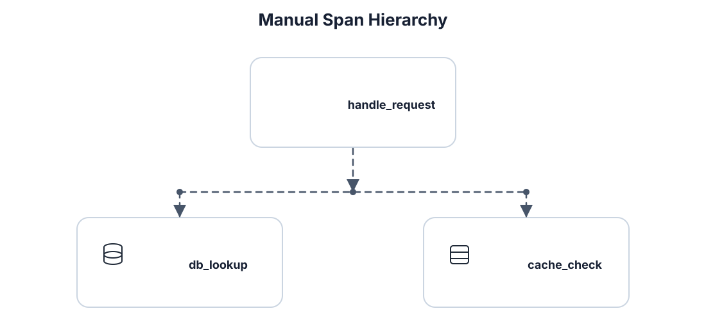
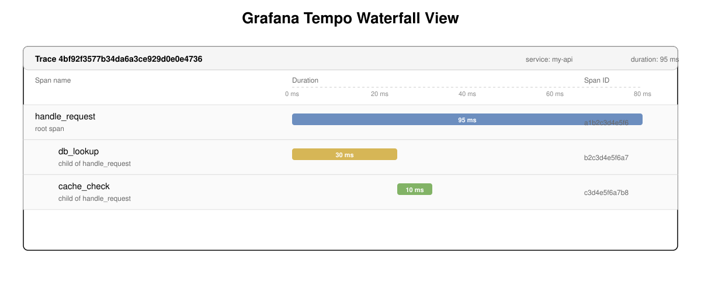
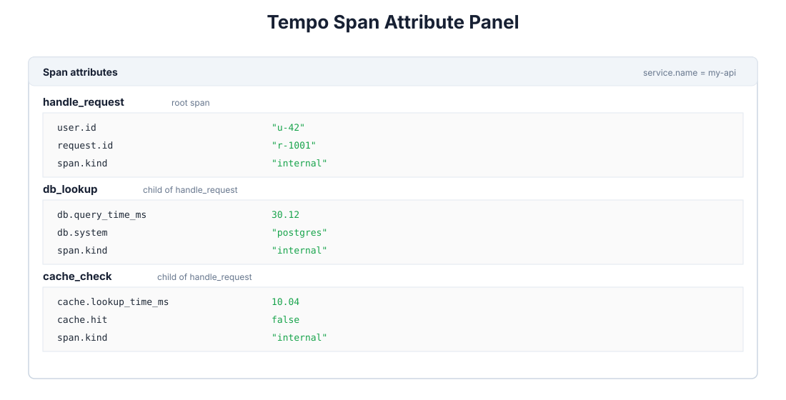

# Lab 11: Adding Manual Spans and Custom Attributes

**Module 56 | Observability & Distributed Tracing**

## Introduction

Auto-instrumentation captures framework-level activity such as HTTP handlers and database calls. It cannot describe domain-specific work such as a multi-step business workflow. Manual spans fill that gap by letting application code declare exactly which units of work matter.

Custom span attributes carry business context such as user IDs, request IDs, or measured durations. They turn a generic trace into a queryable record that answers questions like "how long does the cache lookup take for tenant X" or "which users triggered the slowest requests last hour".

This lab extends the Flask API from Lab 10 with manual spans. You create a root span for the request handler, add nested child spans for a database lookup and a cache check, and attach custom attributes to each span. You then observe the resulting hierarchy and attribute panel in Grafana Tempo.

## Learning Objectives

By the end of this lab you will be able to:

- Obtain a tracer and create a root span with the `start_as_current_span` context manager.
- Attach custom business attributes to a span through `set_attribute`.
- Create nested child spans that inherit the active context from their parent.
- Read the span hierarchy as a waterfall in Grafana Tempo.
- Diagnose broken parent-child relationships caused by incorrect span activation.

## Task Description

In this lab, a Flask API is extended with manual spans, custom attributes are recorded on each span, and the resulting hierarchy is verified in the Grafana Tempo waterfall.

## Table of Contents

1. Chapter 1: Create Your First Manual Span
2. Chapter 2: Add Custom Business Attributes
3. Chapter 3: Nest Child Spans

## Architecture

The team from Labs 9 and 10 now wants to know what happens inside each request. Auto-instrumentation records that the Flask route ran, but it does not show how long the database lookup took or whether the cache answered the request. Without that information, performance regressions slip through unnoticed.

Your task is to wrap the handler logic in a manually created span, add child spans for the database and cache steps, and record business attributes on each span. After triggering a request, the trace must appear in Grafana Tempo with a clear parent-child waterfall and a populated attribute panel.

## Prerequisites

- Completion of Lab 9 with the Grafana and Tempo stack running.
- Completion of Lab 10 with the Flask API instrumented under `opentelemetry-instrument`.
- A Python 3.10 or newer virtual environment with `opentelemetry-distro` and `opentelemetry-instrumentation-flask` installed.
- Familiarity with Python context managers and the `with` statement.

## Environment Setup

Open a terminal on Linux, macOS, or Windows. Use any text editor or Markdown viewer to read this file side by side.

Reuse the project from Lab 10 by copying it forward and re-entering the virtual environment. All commands below assume you are inside `lab-11-manual-spans/`.

```bash
cp -r lab-10-otel-python-instrumentation lab-11-manual-spans
cd lab-11-manual-spans
source .venv/bin/activate
```

On Windows, activate the virtual environment with `.venv\Scripts\activate` instead of `source .venv/bin/activate`.

Confirm the working directory and the lab folder are present.

```bash
pwd
ls -la
```

The output must end in `/lab-11-manual-spans` and show `app.py` and `.venv/`.

Confirm the Grafana and Tempo stack from Lab 9 is still running. The simplest check from any working directory:

```bash
curl -s http://localhost:3000/api/health
curl -s -o /dev/null -w "%{http_code}\n" http://localhost:4318/v1/traces
```

Grafana should return `{"database":"ok"}`. Tempo should return any HTTP status (a 405 is fine — it means the receiver is listening). If either command fails, return to Lab 9 and run `docker compose up -d` from inside `lab-9-grafana-tempo-compose/`.

Re-export the same OpenTelemetry environment variables from Lab 10.

```bash
export OTEL_SERVICE_NAME=my-api
export OTEL_EXPORTER_OTLP_ENDPOINT=http://localhost:4318
export OTEL_TRACES_EXPORTER=otlp
export OTEL_EXPORTER_OTLP_PROTOCOL=http/protobuf
```

## Chapter 1: Create Your First Manual Span

### Opening Context

The OpenTelemetry SDK exposes a `trace` module that provides access to the global tracer provider. A tracer produces spans scoped to a specific instrumentation library. Passing `__name__` as the instrumentation name lets you identify which library emitted each span in the trace UI.

The recommended way to create a span is the `start_as_current_span` context manager. It activates the span for the duration of the `with` block, so any nested spans created inside automatically attach as children. The span is closed when the block exits, regardless of whether an exception was raised.

### What You Will Build

You will import `trace` from OpenTelemetry, obtain a tracer named after the current module, and wrap the Flask route body in a root span called `handle_request`.

<p align="center"></p>

### Implementation

Replace `app.py` with the following content. Run the heredoc from inside `lab-11-manual-spans/`.

```bash
cat > app.py <<'EOF'
from flask import Flask
from opentelemetry import trace

app = Flask(__name__)
tracer = trace.get_tracer(__name__)

@app.get("/hello")
def hello():
    user_id = "u-42"
    request_id = "r-1001"
    with tracer.start_as_current_span("handle_request") as span:
        span.set_attribute("user.id", user_id)
        span.set_attribute("request.id", request_id)
        return {"message": "hello from instrumented api"}, 200

if __name__ == "__main__":
    app.run(host="0.0.0.0", port=5000)
EOF
```

`from opentelemetry import trace` gives the module access to the global tracer provider. `trace.get_tracer(__name__)` returns a tracer scoped to the current module, which the SDK uses to record the `otel.library.name` attribute on every emitted span.

The `with tracer.start_as_current_span("handle_request") as span:` block starts a new span, sets that span as the current span in the active OpenTelemetry context, and binds the span object to the local variable `span`. When the block exits, the span is ended automatically.

The `set_attribute` calls attach key-value pairs to the span. The keys `user.id` and `request.id` use a dotted namespace convention that follows OpenTelemetry semantic conventions for resource and span attributes.

### Test and Verify

Start the API under the wrapper as in Lab 10.

```bash
opentelemetry-instrument \
    --service_name my-api \
    --exporter_otlp_endpoint http://localhost:4318 \
    --exporter_otlp_protocol http/protobuf \
    -- python -m flask run --host=0.0.0.0 --port=5000
```

Trigger one request.

```bash
curl http://localhost:5000/hello
```

Open Grafana at http://localhost:3000 and choose the `Tempo` datasource in Explore. Search for the service name `my-api`. The latest trace should contain a span named `handle_request`. Click the span to view its attributes panel and confirm `user.id` and `request.id` are listed.

### Checkpoint

- [ ] The `handle_request` span appears in Grafana Explore with both `user.id` and `request.id` attributes.

### Screenshot

> *Drop your screenshot at `./images/lab-11-ch1-grafana-handle-request.png`.*

<p align="center"></p>

## Chapter 2: Add Custom Business Attributes

### Opening Context

Attributes are the searchable metadata of a span. The auto-instrumentation from Lab 10 already records generic attributes such as `http.method` and `http.status_code`. Manual instrumentation adds business context that the framework cannot infer.

OpenTelemetry recommends following semantic conventions for common attribute names. Conventions reduce friction when you build dashboards or alerts, because the same key has the same meaning across services. Names use lowercase dot-separated namespaces such as `db.system`, `http.route`, or `db.query_time_ms`.

### What You Will Build

You will add an attribute that records the duration of an artificial database lookup. The handler will sleep for a short period, measure the elapsed milliseconds, and attach the value as an attribute on the active span.

### Implementation

Replace `app.py` with the following content. Run the heredoc from inside `lab-11-manual-spans/`.

```bash
cat > app.py <<'EOF'
import time
from flask import Flask
from opentelemetry import trace

app = Flask(__name__)
tracer = trace.get_tracer(__name__)

@app.get("/hello")
def hello():
    user_id = "u-42"
    request_id = "r-1001"
    with tracer.start_as_current_span("handle_request") as span:
        span.set_attribute("user.id", user_id)
        span.set_attribute("request.id", request_id)

        start = time.perf_counter()
        time.sleep(0.05)
        elapsed_ms = (time.perf_counter() - start) * 1000
        span.set_attribute("db.query_time_ms", round(elapsed_ms, 2))

        return {"message": "hello from instrumented api"}, 200

if __name__ == "__main__":
    app.run(host="0.0.0.0", port=5000)
EOF
```

The `time.perf_counter()` call returns a high-resolution monotonic clock value. Subtracting the start value and multiplying by 1000 produces an elapsed duration in milliseconds. The `round(elapsed_ms, 2)` call keeps two decimal places so the attribute value stays compact.

`set_attribute` accepts any string key and any primitive value such as a string, integer, float, or boolean. Booleans, strings, and numbers are supported directly. Lists and nested objects are not accepted and will be silently dropped.

### Test and Verify

Restart the API with the new code and trigger another request.

```bash
curl http://localhost:5000/hello
```

In Grafana Explore, open the `handle_request` span. The attribute panel should now list `user.id`, `request.id`, and `db.query_time_ms` with a value near `50`.

### Checkpoint

- [ ] The span includes a `db.query_time_ms` attribute visible in the Grafana span detail panel.

### Screenshot

> *Drop your screenshot at `./images/lab-11-ch2-grafana-db-query-time.png`.*

<p align="center"></p>

## Chapter 3: Nest Child Spans

### Opening Context

A single span represents one unit of work. Realistic workflows chain several units together: a handler dispatches to a database lookup, then a cache check, then a response builder. Each step should become its own span so you can see how long each took and which one failed.

When a child span is created inside an active parent span, the SDK uses the active context to set the parent. No explicit parent identifier needs to be passed. This implicit propagation is the recommended pattern because it composes correctly with `asyncio`, threading, and request-handling middleware.

### What You Will Build

You will split the handler into three spans. The `handle_request` span remains the root. Two new spans named `db_lookup` and `cache_check` are created inside it as children. Each child span records a domain-specific attribute.

<p align="center"></p>

### Implementation

Replace `app.py` with the following content. Both child spans sit inside the active `handle_request` parent, so no explicit parent reference is needed. Run the heredoc from inside `lab-11-manual-spans/`.

```bash
cat > app.py <<'EOF'
import time
from flask import Flask
from opentelemetry import trace

app = Flask(__name__)
tracer = trace.get_tracer(__name__)

@app.get("/hello")
def hello():
    user_id = "u-42"
    request_id = "r-1001"
    with tracer.start_as_current_span("handle_request") as root:
        root.set_attribute("user.id", user_id)
        root.set_attribute("request.id", request_id)

        with tracer.start_as_current_span("db_lookup") as db:
            start = time.perf_counter()
            time.sleep(0.03)
            elapsed_ms = (time.perf_counter() - start) * 1000
            db.set_attribute("db.query_time_ms", round(elapsed_ms, 2))
            db.set_attribute("db.system", "postgres")

        with tracer.start_as_current_span("cache_check") as cache:
            start = time.perf_counter()
            time.sleep(0.01)
            elapsed_ms = (time.perf_counter() - start) * 1000
            cache.set_attribute("cache.lookup_time_ms", round(elapsed_ms, 2))
            cache.set_attribute("cache.hit", False)

        return {"message": "hello from instrumented api"}, 200

if __name__ == "__main__":
    app.run(host="0.0.0.0", port=5000)
EOF
```

Each `start_as_current_span` call inside the handler becomes a child of the currently active span. When `start_as_current_span("db_lookup")` runs, the active context contains `handle_request`, so the new span becomes its child. When `db_lookup` exits, the active context returns to `handle_request`, allowing `cache_check` to attach as a sibling child.

The `db.system` and `cache.hit` attributes follow the OpenTelemetry semantic conventions for database and cache spans. Recording them makes the trace searchable in Tempo and consistent with traces from other services that follow the same conventions.

<p align="center"></p>

### Test and Verify

Restart the API with the updated code and trigger one request.

```bash
curl http://localhost:5000/hello
```

In Grafana Explore, open the trace and inspect the waterfall. The view should show three rows: a top-level `handle_request` bar, then indented `db_lookup` and `cache_check` bars underneath. Click each bar to view its attributes.

### Checkpoint

- [ ] The Grafana waterfall shows the three-span hierarchy with `db_lookup` and `cache_check` nested under `handle_request`.

### Screenshot

> *Drop your screenshot at `./images/lab-11-ch3-grafana-waterfall.png`.*

<p align="center"></p>

### Experiment

1. Replace `start_as_current_span` with `start_span` for both child spans and drop the `with` wrappers.

```python
db = tracer.start_span("db_lookup")
time.sleep(0.03)
db.end()

cache = tracer.start_span("cache_check")
time.sleep(0.01)
cache.end()
```

2. Restart the API and trigger a request.
3. In Grafana Explore, query the service name `my-api`. The result should show three separate root traces rather than a single trace with three nested spans.
4. Restore the `start_as_current_span` form and verify the hierarchy returns to a single parent trace with two children.

`start_span()` creates a span but does not set it as the active span in the context. Each subsequent call has no parent in scope and falls back to creating a root span. The spans are exported independently, and Tempo groups them by trace ID, producing three unrelated traces instead of one hierarchical trace.

## Conclusion

You extended the Flask API from Lab 10 with manual spans that capture the business workflow of each request. The `handle_request` span serves as the parent for two children: `db_lookup` for the database step and `cache_check` for the cache step. Each child carries attributes that describe its measured duration and its semantic type.

Grafana Tempo renders the result as a three-row waterfall with a populated attribute panel for every span. The experiment demonstrated that calling `start_span()` without an explicit context creates independent traces instead of a hierarchy, reinforcing the importance of `start_as_current_span` for parent-child propagation.

This lab focused on creating and annotating spans within a single process. You did not propagate trace context across service boundaries, configure span sampling, or wire the spans into metrics. The next lab instruments an outbound HTTP call so the receiving service continues the same trace, producing linked parent and child spans across two services.