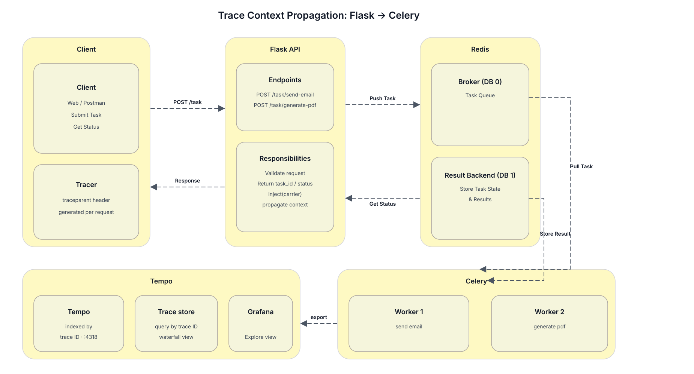

# Lab 12 — Propagating Trace Context from Flask to Celery

## Introduction

In the previous labs a single trace was shipped from a Flask request into Tempo. Now the request hands work to a background worker, and the worker span should live **inside the same trace** as the Flask span — not as a separate, orphaned trace.

The mechanism for that is **context propagation**: Flask packs the current trace context into a small dict (the carrier), hands it to Celery as a task argument, and the worker extracts the context and opens a child span from it.

<p align="center"></p>

## Learning Objectives

By the end of this lab you will be able to:

- Inject the current trace context into a carrier dict with `propagate.inject(carrier)`.
- Pass the carrier as a task argument to a Celery worker.
- Extract the trace context from the carrier in the worker with `propagate.extract(carrier)`.
- Continue the original trace from the worker by passing the extracted context to `start_as_current_span`.
- Verify in Grafana Tempo that both spans share one trace ID.

## Task Description

In this lab, a Flask endpoint enqueues a Celery task with the trace context as a carrier, the worker extracts that context, opens a child span from it, and the resulting shared trace is verified in Tempo.

## Table of Contents

1. Chapter 1 — Set Up the Project (Flask + Celery + OpenTelemetry)
2. Chapter 2 — Inject Trace Context in the Flask Endpoint
3. Chapter 3 — Extract Context and Continue the Trace in the Worker

## Architecture

The system has two services on the host: a Flask API that accepts HTTP requests, and a Celery worker that consumes tasks from a Redis broker. Both processes emit OpenTelemetry spans to the same Tempo instance from Lab 9. The Flask instrumentation opens a server span for each request. Before enqueueing the Celery task, the endpoint packages that span's trace context into a plain dict (the carrier) and hands it to Celery as a task kwarg. The worker reads the carrier, reconstructs the context, and opens a child span from it so the two spans share one trace ID.

## Prerequisites

- Completion of Lab 9 with the Grafana and Tempo stack running on `http://localhost:3000`.
- Completion of Lab 10 with the Flask API auto-instrumented and exporting OTLP/HTTP to Tempo.
- Completion of Lab 11 with manual spans using `tracer.start_as_current_span(...)` and `set_attribute`.
- Redis running locally on `localhost:6379`.
- Python 3.10 or newer with `pip` and a virtual environment manager.

## Environment Setup

You will need two services that talk to each other: a Flask API that receives HTTP requests, and a Celery worker that processes long-running tasks in the background. Both processes must emit OpenTelemetry spans to the same Tempo instance you stood up in Lab 9.

### 1.1 Create the project structure

Open a terminal on Linux, macOS, or Windows and run:

```bash
mkdir trace-lab && cd trace-lab
python -m venv .venv
source .venv/bin/activate          # Windows: .venv\Scripts\activate
pip install --upgrade pip
```

Create the application files:

```
trace-lab/
├── app.py
├── tasks.py
├── otel_setup.py
└── requirements.txt
```

### 1.2 Install the dependencies

`requirements.txt`:

```
flask==3.0.3
celery==5.4.0
redis==5.0.4
opentelemetry-api==1.27.0
opentelemetry-sdk==1.27.0
opentelemetry-exporter-otlp-proto-http==1.27.0
opentelemetry-instrumentation-flask==0.48b0
opentelemetry-instrumentation-celery==0.48b0
```

Install everything:

```bash
pip install -r requirements.txt
```

These packages give you:

- `opentelemetry-api` — the propagation API (`inject`, `extract`) and the `Tracer` used to start spans.
- `opentelemetry-instrumentation-flask` and `opentelemetry-instrumentation-celery` — auto-instrumentation that opens server spans for Flask requests and for Celery task execution.
- `opentelemetry-exporter-otlp-proto-http` — ships spans to Tempo over OTLP HTTP.

### 1.3 Configure Celery with Redis as the broker

`tasks.py`:

```python
from celery import Celery

celery_app = Celery(
    "trace-lab",
    broker="______________________",     # blank 1
    backend="redis://localhost:6379/0",
)
```

`app.py`:

```python
from celery import Celery
from tasks import celery_app
flask_app = Flask(__name__)
flask_app.config["CELERY_BROKER_URL"] = "______________________"
flask_app.config["CELERY_RESULT_BACKEND"] = "redis://localhost:6379/0"
celery_app.conf.update(broker_url=flask_app.config["CELERY_BROKER_URL"])
```

**Fill in the blanks**

- Blank 1 — the Redis broker URL that both Flask and Celery will use.
- Blank 2 — same Redis URL so the Flask process can enqueue tasks.

> **Hint:** You already saw this URL in `tasks.py`. Celery and Flask must agree on the broker, or Flask will enqueue into a queue the worker never listens to.

### 1.4 Start Redis and verify both processes

In one terminal start Redis:

```bash
redis-server
```

In a second terminal start the worker:

```bash
celery -A tasks worker --loglevel=info
```

In a third terminal start the Flask API:

```bash
opentelemetry-instrument --service_name=flask-api \
  flask --app app run --port 8000
```

Visit `http://localhost:8000/` and you should see a running API. The worker terminal should print that it is ready to receive tasks.

### 1.5 What you should have at this point

- Redis running on `localhost:6379`.
- A Flask process on port `8000` instrumented with OpenTelemetry.
- A Celery worker connected to the same broker.
- Spans from both processes exporting to the same Tempo instance.

### Think First

Open `<TODO>` and answer:

1. Why does the `opentelemetry-instrument` wrapper need to wrap the Flask process but not the worker?
2. What happens if Flask is using `redis://localhost:6379/0` for the broker but the worker is using `redis://localhost:6379/1`?

---

## Chapter 1 — Set Up the Project (Flask + Celery + OpenTelemetry)

This chapter corresponds to the **Environment Setup** block above. The implementation steps for the project layout, dependency install, broker configuration, and process startup are documented there so the running stack is ready before the propagation code in the next chapters.

---

## Chapter 2 — Inject Trace Context in the Flask Endpoint

When a request comes in, Flask instrumentation opens a server span and makes it the current context. Before the work is handed off to Celery, that context is captured into a carrier dict and passed as a task argument.

### 2.1 The endpoint that creates a task

`app.py`:

```python
from flask import Flask, jsonify, request
from celery import Celery
from tasks import celery_app, process_item
from opentelemetry import trace
from opentelemetry.propagate import inject

flask_app = Flask(__name__)
tracer = trace.get_tracer(__name__)

@flask_app.post("/process")
def enqueue_process():
    item_id = request.json.get("item_id")
    carrier = {}
    ______________________  # blank 3
    task_result = process_item.delay(item_id, ______________________)  # blank 4
    return jsonify({"task_id": task_result.id, "trace_id": format(trace.get_current_span().get_span_context().trace_id, "032x")})
```

### 2.2 What `inject` does

`inject(carrier)` walks up to the currently active span context (here: the Flask server span) and writes the W3C `traceparent` header into the carrier dict. After `inject`, the carrier looks like:

```python
{"traceparent": "00-aaaa....-bbbb....-01"}
```

That single string is enough to identify the trace and the parent span — no other state needs to be serialized.

### 2.3 Confirm the trace ID is logged

The `trace_id` returned in the JSON is something to search for in Tempo:

```bash
curl -X POST http://localhost:8000/process \
  -H "Content-Type: application/json" \
  -d '{"item_id": 42}'
```

Response:

```json
{
  "task_id": "f1c8...",
  "trace_id": "a1b2c3d4e5f6..."
}
```

Save that `trace_id`. It will be needed in Chapter 3.

### Think First

1. If `propagate.inject(carrier)` is called **before** any span is active, what will the carrier dict contain?
2. Why is the carrier passed as a **keyword argument** (`carrier=carrier`) to `delay()`, rather than as a positional argument?

### Test and Verify

Send a request and confirm the worker logs the task and the Flask terminal printed the `trace_id`. Hold on to that ID — it will be searched in Tempo in the next chapter.

---

## Chapter 3 — Extract Context and Continue the Trace in the Worker

On the worker side, the carrier is received, `extract` rebuilds the context, and a child span is opened from it. The child's `trace_id` will match the Flask span's `trace_id` exactly.

### 3.1 The Celery task

`tasks.py`:

```python
from celery import Celery
from opentelemetry import trace
from opentelemetry.propagate import extract

celery_app = Celery("trace-lab", broker="redis://localhost:6379/0", backend="redis://localhost:6379/0")
tracer = trace.get_tracer(__name__)

@celery_app.task(name="trace-lab.process_item")
def process_item(item_id, carrier=None):
    ctx = ______________________  # blank 5
    with tracer.start_as_current_span("celery-process", ______________________=ctx) as span:  # blank 6
        span.set_attribute("item.id", item_id)
        span.set_attribute("worker.hostname", socket.gethostname())
        result = do_work(item_id)
        span.set_attribute("result.size", len(result))
        return result

def do_work(item_id):
    return f"processed {item_id}"
```

### 3.2 What `extract` does

`extract(carrier)` reads the `traceparent` header from the carrier dict and reconstructs a `Context` object. That context carries the original trace_id and the parent span_id. When the context is passed as `context=ctx` to `start_as_current_span`, the new span becomes a *child* of the Flask span — same trace, different span.

### 3.3 Confirm a single trace in Grafana

Open Grafana Explore → choose the Tempo datasource → paste the `trace_id` captured earlier → search.

Exactly **two spans** are joined under that trace:

- `POST /process` — the Flask server span (root).
- `celery-process` — the worker span (child), with `item.id` set.

Click the root span. The trace tree shows the worker span indented underneath, with the parent link drawn between them.

### Test and Verify

If Tempo is searched by the trace ID logged from the Flask endpoint, predict how many spans appear in the result. Then run the search.

### Experiment — break propagation, then fix it

This is the most important exercise in the lab. The value of `inject`/`extract` is demonstrated by removing them.

1. In `app.py`, comment out the `inject(carrier)` line.
2. In `tasks.py`, change the `with tracer.start_as_current_span(...)` block to open a *new* span without a `context=` argument — just `tracer.start_as_current_span("celery-process")`.
3. Trigger a request: `curl -X POST http://localhost:8000/process -H "Content-Type: application/json" -d '{"item_id": 99}'`.
4. Open Tempo and search for the `trace_id` returned in the response.

Only the Flask span appears — the worker span exists in Tempo but with a brand-new trace ID, so it does not show up under this search. The two spans are now two unrelated traces.

5. Restore the `inject`/`extract` calls. Repeat the request and search again. The two spans share one trace ID again.

### Think First

1. Why does removing `inject`/`extract` create two separate traces instead of one broken trace?
2. What would happen if `inject` was kept but `extract` was removed — would the worker span still be a child of the Flask span?

---

## Conclusion

`propagate.inject(carrier)` packs the active span's W3C trace context into a plain dict. `propagate.extract(carrier)` rebuilds the `Context` from that dict on the receiving side. Passing the extracted context as `context=ctx` to `start_as_current_span` makes the new span a child of the original trace. The carrier is a regular Python dict — it travels through any boundary that can carry a dict (Celery task kwargs, Redis, RabbitMQ, Kafka headers, HTTP headers).

The propagation-break experiment demonstrated that without `inject` and `extract`, the Flask and Celery spans end up in separate traces. Restoring the calls reunites them under one trace ID.

In the next lab this setup is used to add metrics and logs and observe how Tempo, Prometheus, and Loki correlate by trace ID.

---

## The Principles

- A trace ID is the join key for everything that carries it: headers, payloads, log fields.
- `propagate.inject` and `propagate.extract` are the only mechanism for cross-process trace continuity.
- Without explicit propagation, spans in different processes form unrelated traces.
- The carrier format follows the W3C Trace Context specification and stays compatible across languages.

---

## Troubleshooting

| Problem | Likely Cause | Resolution |
|---------|--------------|------------|
| Flask and worker traces do not share a trace ID | `propagate.inject` or `propagate.extract` is missing | Add `propagate.inject(carrier)` in the Flask endpoint and `propagate.extract(carrier)` in the worker task |
| Worker reports "no such queue" | Flask and worker are using different Redis databases | Set both Flask and Celery to `redis://localhost:6379/0` |
| `redis://localhost:6379/0` returns connection refused | Redis is not running | Start Redis with `redis-server` in a separate terminal |
| `inject(carrier)` runs before any span is active | The handler executes outside any Flask request context | Ensure `inject` runs inside the request handler so the auto-instrumentation has opened the server span |
| `start_as_current_span(..., context=ctx)` raises TypeError | The carrier dict was passed as a positional argument | Pass the carrier as a keyword argument `carrier=carrier` |

---

## Next Steps

- Add metrics and logs to the same Flask and Celery processes, and correlate them by trace ID.
- Propagate trace context across more service boundaries (Kafka, RabbitMQ, gRPC).
- Configure sampling rules in the OTLP exporter to reduce storage cost while preserving long-tail traces.
- Wire the trace ID into structured log output so every log line is joinable to the matching span.

---

## Additional Resources

- https://opentelemetry.io/docs/concepts/context-propagation/
- https://www.w3.org/TR/trace-context/
- https://opentelemetry-python.readthedocs.io/en/stable/api/propagate.html
- https://docs.celeryq.dev/en/stable/tutorials/task-cookbook.html
- https://opentelemetry.io/docs/languages/python/instrumentation/