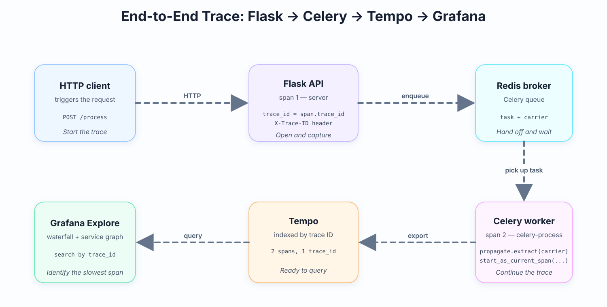
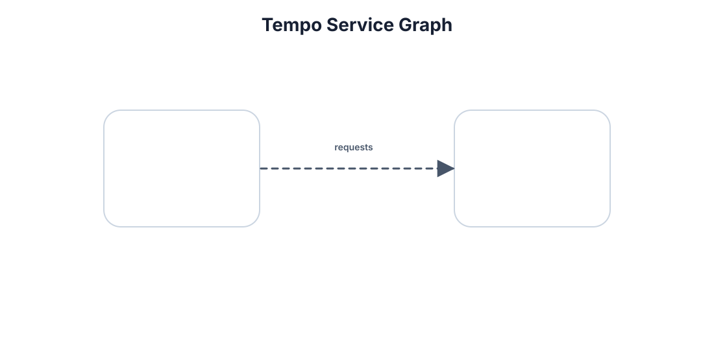

# Lab 13 — Visualizing the End-to-End Distributed Trace in Grafana Tempo

## Introduction

Distributed tracing produces spans in two services — a Flask API on the request side and a Celery worker on the task side — and ships both to the same Tempo instance. This lab turns that pipeline into something that can be read visually: one trace ID, one waterfall, one service graph showing which service is slow and why.

<p align="center"></p>

## Learning Objectives

- Capture the active trace ID on the Flask response using `X-Trace-ID`.
- Query Tempo by trace ID in Grafana Explore.
- Read the waterfall to identify the slowest span in a trace.
- Read the service graph to identify which service contributes the most latency.
- Inject latency into the worker span and observe how the waterfall attributes it.

## Task Description

In this lab, the trace ID is exposed on the Flask response, the resulting trace is located in Grafana Explore by trace ID, and the waterfall and service graph are used to identify the slowest service and span.

## Table of Contents

1. Chapter 1 — Trigger the Full Request and Capture the Trace ID
2. Chapter 2 — Navigate the Trace Waterfall in Grafana
3. Chapter 3 — Interpret Latency Using the Waterfall and Service Graph

## Architecture

OpenTelemetry emits a **span** for every unit of work in a process. A span carries a name, start/end timestamps, attributes, and — crucially — a **trace ID** that is shared with every other span in the same trace. A **tracer** is the object that creates spans via `tracer.start_as_current_span(...)`. The mechanism that moves a trace ID across a process boundary (HTTP, Redis, Celery, Kafka) is called **context propagation**: the sender packages the current trace context into a plain Python dict called a **carrier**, the receiver reads it back and starts a child span from it. The serialized form is a single header named **traceparent** defined by the W3C Trace Context standard. The place where all spans end up — indexed by trace ID and searchable — is **Tempo**, which speaks the **OTLP** (OpenTelemetry Line Protocol) format over HTTP on port `4318`. In Grafana, Tempo renders spans as a **waterfall**, a left-to-right diagram in which each row is one span and the bar width is the span's duration.

## Prerequisites

- Lab 9 — running Grafana + Tempo stack reachable on `http://localhost:3000` with the Tempo datasource provisioned.
- Lab 10 — Flask API auto-instrumented with `opentelemetry-instrument` and exporting OTLP/HTTP to Tempo.
- Lab 11 — manual child spans using `tracer.start_as_current_span(...)` with custom attributes.
- Lab 12 — Celery worker that calls `propagate.extract(carrier)` and `start_as_current_span(..., context=ctx)`.
- Redis running locally on `localhost:6379`.

## Environment Setup

This lab builds on the stack from Labs 9–12. Make sure all three processes are running before you start.

Create the project directory and Python virtual environment if you have not already:

```bash
mkdir trace-lab && cd trace-lab
python -m venv .venv
source .venv/bin/activate          # Windows: .venv\Scripts\activate
pip install --upgrade pip
pip install -r requirements.txt
```

`requirements.txt`:

```
flask==3.0.3
celery==5.4.0
redis==5.0.4
opentelemetry-api==1.27.0
opentelemetry-sdk==1.27.0
opentelemetry-exporter-otlp-proto-http==1.27.0
opentelemetry-instrumentation-flask==0.48b0
opentelemetry-instrumentation-celery==0.48b0
```

Open three terminals. Each one must `cd trace-lab` first so the modules import the same way.

```bash
# terminal 1
redis-server
```

```bash
# terminal 2
cd trace-lab && source .venv/bin/activate
celery -A tasks worker --loglevel=info
```

```bash
# terminal 3
cd trace-lab && source .venv/bin/activate
export OTEL_SERVICE_NAME=flask-api
export OTEL_EXPORTER_OTLP_ENDPOINT=http://localhost:4318
export OTEL_TRACES_EXPORTER=otlp
export OTEL_EXPORTER_OTLP_PROTOCOL=http/protobuf
opentelemetry-instrument --service_name=flask-api \
  flask --app app run --port 8000
```

The Flask API is now reachable at `http://localhost:8000`, the worker is consuming tasks from Redis, and both processes are exporting OTLP/HTTP spans to Tempo.

## Chapter 1 — Trigger the Full Request and Capture the Trace ID

### Opening Context

Tempo organizes spans by trace ID. Without the trace ID on the request response, locating the matching spans in Grafana requires searching by service name and time window. Exposing the trace ID on the response makes the next chapter trivial.

### What You Will Build

A Flask endpoint that sets the current trace ID on the response under the `X-Trace-ID` header so any HTTP client can capture it with `curl -i`.

### Implementation

In `app.py`, replace the `/process` handler so it sets the trace ID header on the response. Run from inside `trace-lab/`.

```bash
cat > app.py <<'EOF'
import socket
from flask import Flask, jsonify, request, make_response
from celery import Celery
from tasks import celery_app, process_item
from opentelemetry import trace
from opentelemetry.propagate import inject

flask_app = Flask(__name__)
flask_app.config["CELERY_BROKER_URL"] = "redis://localhost:6379/0"
flask_app.config["CELERY_RESULT_BACKEND"] = "redis://localhost:6379/0"
celery_app.conf.update(broker_url=flask_app.config["CELERY_BROKER_URL"])
tracer = trace.get_tracer(__name__)

@flask_app.post("/process")
def enqueue_process():
    item_id = request.json.get("item_id")
    carrier = {}
    propagate.inject(carrier)
    process_item.delay(item_id, carrier=carrier)
    span = trace.get_current_span()
    trace_id_hex = format(span.get_span_context().trace_id, "032x")
    response = make_response(jsonify({"task_id": "...", "trace_id": trace_id_hex}))
    response.headers["X-Trace-ID"] = trace_id_hex
    return response
EOF
```

The header is named `X-Trace-ID` — a common convention. The same string is used in Chapter 2's deep-link URL.

`trace.get_current_span()` returns the active span — the Flask server span opened by the auto-instrumentation. `span.get_span_context().trace_id` is an integer; formatting it as `"032x"` produces a 32-character lowercase hex string that matches what Tempo stores internally. Setting it as a response header makes the value reachable by any HTTP client without parsing the JSON body.

Trigger the request and capture the header:

```bash
curl -i -X POST http://localhost:8000/process \
  -H "Content-Type: application/json" \
  -d '{"item_id": 7}'
```

Sample response:

```
HTTP/1.1 200 OK
Content-Type: application/json
X-Trace-ID: a1b2c3d4e5f6a1b2c3d4e5f6a1b2c3d4

{"task_id":"f1c8...","trace_id":"a1b2c3d4e5f6a1b2c3d4e5f6a1b2c3d4"}
```

Save the `X-Trace-ID` value for use in the next chapter.

### Checkpoint

- [ ] The response carries the `X-Trace-ID` header with a 32-character lowercase hex value.
- [ ] The worker terminal logged the task being processed.

### Screenshot

> *Drop your screenshot at `./images/lab-13-ch1-curl-trace-id-header.png`.*

<p align="center"></p>

### Experiment

Replace the blank with a different header name (for example `X-Request-ID`) and trigger the request again. Confirm that the value is still 32 characters of lowercase hex but is no longer named `X-Trace-ID`. Restore `X-Trace-ID` after observing.

## Chapter 2 — Navigate the Trace Waterfall in Grafana

### Opening Context

A trace ID is only useful if it can be turned into a waterfall in a small number of steps. Grafana's Explore view provides two ways: a Search-by-trace-ID tab for direct lookup, and a TraceQL tab for attribute-based queries.

### What You Will Build

A repeatable navigation flow: open Grafana Explore, pick the Tempo datasource, paste the trace ID, and arrive at the waterfall in two clicks.

### Implementation

Navigate to `http://localhost:3000/explore`. In the top datasource dropdown, choose the **Tempo** datasource configured in Lab 9. In the query type selector, switch to **Search**. Type the trace ID from `X-Trace-ID` into the **Trace ID** field, then click **Run query**.

<p align="center"></p>

The waterfall opens. Each row is one span:

- The top row is the root span — `POST /process`, the Flask server span from Lab 10.
- The second row is `celery-process`, the child span from Lab 12, indented under its parent.

The bar width is the span's duration. Click any bar to expand it and see attributes (`item.id`, `worker.hostname`).

TraceQL alternative — in the query type dropdown, choose **TraceQL** and write a query that filters by service name and the trace ID you captured. Replace `<TRACE_ID>` with the 32-character hex value from `X-Trace-ID`:

```traceql
{ resource.service.name = "flask-api" && traceID = "<TRACE_ID>" }
```

Deep-link directly to a trace using the URL pattern. Substitute `<TRACE_ID>` with the value from `X-Trace-ID`:

```
http://localhost:3000/explore?orgId=1&left=%7B%22datasource%22:%22Tempo%22,%22queries%22:%5B%7B%22query%22:%22<TRACE_ID>%22%7D%5D%7D
```

Build and open it from the shell, saving the trace ID from the previous chapter into a shell variable first:

```bash
TRACE_ID=$(curl -s -X POST http://localhost:8000/process \
    -H "Content-Type: application/json" \
    -d '{"item_id": 7}' | grep -o '"trace_id":"[^"]*"' | cut -d'"' -f4)
echo "http://localhost:3000/explore?datasource=Tempo&query=$TRACE_ID"
```

The URL is a standard Grafana Explore deep link. The `datasource` field selects Tempo; the nested `query` field is the value pasted into the search input. The percent-encoded curly braces and quotes are the JSON object Grafana reads to restore the panel state on load.

### Checkpoint

- [ ] The waterfall shows two spans: `POST /process` as the root and `celery-process` as the child.
- [ ] The `celery-process` span shows the custom attribute `item.id = 7`.

### Screenshot

> *Drop your screenshot at `./images/lab-13-ch2-grafana-waterfall.png`.*

<p align="center"></p>

### Experiment

Open the deep-link URL in an incognito window with the same Grafana instance reachable. Confirm the trace loads without any prior session state. Close the window and reopen — Tempo is stateless, so the result is reproducible.

## Chapter 3 — Interpret Latency Using the Waterfall and Service Graph

### Opening Context

The waterfall answers the question *"how long did each step take in this trace?"* The service graph answers the question *"which service contributes the most latency across all traces?"* Both views are required to read the system end-to-end.

### What You Will Build

A procedure for reading a single trace's waterfall, switching to the service graph to compare aggregate latency, and confirming the attribution by injecting a known delay.

### Implementation

Open the waterfall from Chapter 2. Look at the bars left-to-right. The wider the bar, the longer that span ran. The span whose bar reaches farthest to the right is the slowest operation in the trace.

In the trace from Chapter 1 the `celery-process` bar is wider than the Flask bar — the worker is the slow part, not the API. The widest bar in the waterfall is the slowest span.

Switch from the trace view to the **Service Graph** view in Grafana Explore. Tempo renders two nodes and an edge:

- **`flask-api`** node.
- **`celery-worker`** node.
- An arrow labeled with rolled-up traffic stats — requests per second and a percentile latency (for example `p95 = 2.3s`).

The service graph shows aggregate dependency and latency over many traces. It does not show individual span attributes or parent-child links within a single trace. The service graph shows aggregate traffic and latency statistics between services, which the per-trace waterfall view does not display.

For a single trace, the widest bar in the waterfall identifies the slowest span. For aggregate analysis across many traces, the service graph identifies which edge contributes the most latency on average.

Tempo computes the service graph by extracting the parent-child span relationships across all stored traces and rolling them up by `service.name`. The `p95` label on the edge is the 95th percentile of the time the downstream service spent processing each request, calculated from the span durations themselves.

### Checkpoint

- [ ] The widest bar in the baseline trace is the `celery-process` span.

### Screenshot

> *Drop your screenshot at `./images/lab-13-ch3-tempo-service-graph.png`.*

<p align="center"></p>

### Experiment

1. In `tasks.py`, add `time.sleep(2)` at the start of `do_work` inside the `celery-process` block.
2. Trigger a new request: `curl -X POST http://localhost:8000/process -H "Content-Type: application/json" -d '{"item_id": 99}'`.
3. Open Grafana, paste the new `X-Trace-ID` into the Tempo search.
4. Observe the waterfall. The `celery-process` bar is now the widest by far — about 2 seconds wide — while the Flask span stays the same as before.
5. Remove the `time.sleep(2)` after observing.

The latency is attributed to the worker, where it actually happened. The waterfall does not blame the API.

## Conclusion

By the end of this lab, the request trace is fully observable end-to-end:

- Flask exposes the active trace ID on the response under `X-Trace-ID`.
- Grafana Explore's Tempo search opens the full waterfall by trace ID in two clicks.
- TraceQL filters traces by attribute when no specific ID is known.
- The widest bar in the waterfall identifies the slowest span in this trace.
- The service graph view summarizes traffic and latency across all traces between services.

The system built across Labs 9–13 is now capable of answering the question *"why is this request slow?"* from a single trace ID.