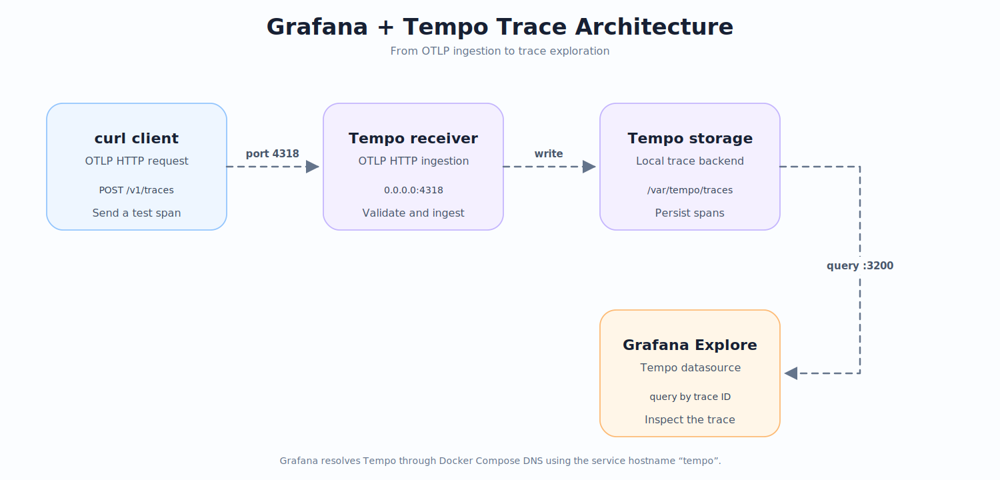
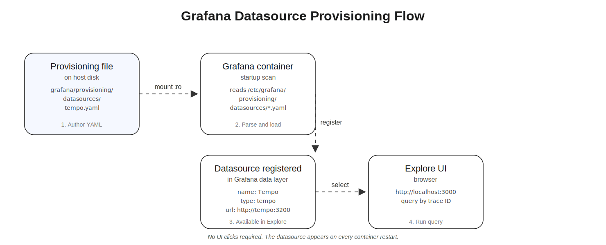

# Lab 9: Deploying Grafana and Tempo with Docker Compose

**Module 55 | Observability & Distributed Tracing**

## Introduction

Distributed tracing captures the path of a request as it moves across services. Each unit of work is recorded as a span, and related spans are grouped into a trace. Without a tracing backend, these spans disappear as soon as the process exits.

Tempo is a high-volume tracing backend developed by Grafana Labs. It ingests spans over the OpenTelemetry Protocol (OTLP) and stores them locally with minimal configuration. Grafana acts as the visualization layer, querying Tempo to render trace timelines.

This lab deploys Grafana and Tempo together using Docker Compose. You will configure the OTLP receiver, provision the Tempo datasource in Grafana, send a test span with curl, and locate the resulting trace in Grafana Explore.

## Learning Objectives

By the end of this lab you will be able to:

- Deploy a two-service Docker Compose stack running Grafana and Tempo.
- Configure Tempo to accept OTLP HTTP spans on port 4318.
- Provision a Grafana datasource pointing to Tempo at startup.
- Send a valid OTLP span payload using curl with the correct Content-Type header.
- Query a trace by trace ID in Grafana Explore and verify the span landed in Tempo.

### Prerequisites

- Familiarity with Docker and Docker Compose syntax.
- A working Docker Engine installation with the Compose plugin.
- Basic understanding of YAML configuration files.
- Basic understanding of HTTP request methods and headers.

## Prologue

You join the platform team at a mid-sized SaaS company that has just begun instrumenting its microservices. The first service is ready, but the team has no backend to receive spans and no dashboard to view them.

Your task is to stand up a minimal tracing stack on a single host. You will use Grafana Tempo as the tracing backend and Grafana as the query interface. You must verify the pipeline end-to-end by sending a single test span with curl and observing it appear in Grafana.

## Environment Setup

Open a terminal on a Linux, macOS, or Windows host with Docker Engine and the Compose plugin installed. Use any text editor or Markdown viewer to read this file side by side.

Create the lab folder structure and change into it.

```bash
mkdir -p lab-9-grafana-tempo-compose/grafana/provisioning/datasources
cd lab-9-grafana-tempo-compose
```

Verify Docker and the Compose plugin are installed.

```bash
docker --version
docker compose version
```

Create an empty file for the Tempo configuration.

```bash
touch tempo.yml
```

<details>
<summary>Prediction: What happens if port 3000 is already in use when docker compose up runs?</summary>

Docker Compose fails to start the grafana service and prints a "bind: address already in use" error. The tempo service may still start. You must either stop the conflicting process or change the host port mapping in docker-compose.yml to a free port such as 3001.
</details>

## Chapter 1: Write the Docker Compose Stack

### Opening Context

Docker Compose lets you define multi-container applications in a single declarative file. Each service maps to one container, and port mappings expose container ports to the host. For Grafana and Tempo to communicate, they must share a network and reference each other by service name.

The two services you deploy have different roles. Tempo listens on port 3200 for HTTP queries and 4318 for OTLP ingestion. Grafana listens on port 3000 for the web UI. Grafana will reach Tempo over the internal Docker network using the hostname `tempo`.

### What You Will Build

You will create a `docker-compose.yml` file that defines the grafana and tempo services, exposes their ports to the host, and mounts configuration files into the containers.

<p align="center"></p>

### Think First

<details>
<summary>Question: Why does Grafana reference Tempo as http://tempo:3200 instead of http://localhost:3200?</summary>

The hostname `tempo` resolves through Docker's internal DNS to the tempo container's IP on the shared network. `localhost` inside a container refers to that container itself, not to sibling containers. Using the service name guarantees Grafana reaches Tempo regardless of the assigned IP.
</details>

### Implementation

Create `docker-compose.yml` with the following content. Fill in the blank.

```yaml
version: "3.9"

services:
  tempo:
    image: grafana/tempo:latest
    command: ["-config.file=/etc/tempo.yml"]
    volumes:
      - ./tempo.yml:/etc/tempo.yml:ro
      - tempo-data:/var/tempo
    ports:
      - "3200:3200"
      - "___________:4318"

  grafana:
    image: grafana/grafana:latest
    environment:
      - GF_SECURITY_ADMIN_USER=admin
      - GF_SECURITY_ADMIN_PASSWORD=admin
    volumes:
      - ./grafana/provisioning:/etc/grafana/provisioning:ro
    ports:
      - "3000:3000"
    depends_on:
      - tempo

volumes:
  tempo-data:
```

<details>
<summary>Reveal answer</summary>

```yaml
version: "3.9"

services:
  tempo:
    image: grafana/tempo:latest
    command: ["-config.file=/etc/tempo.yml"]
    volumes:
      - ./tempo.yml:/etc/tempo.yml:ro
      - tempo-data:/var/tempo
    ports:
      - "3200:3200"
      - "4318:4318"

  grafana:
    image: grafana/grafana:latest
    environment:
      - GF_SECURITY_ADMIN_USER=admin
      - GF_SECURITY_ADMIN_PASSWORD=admin
    volumes:
      - ./grafana/provisioning:/etc/grafana/provisioning:ro
    ports:
      - "3000:3000"
    depends_on:
      - tempo

volumes:
  tempo-data:
```

The blank is `4318`. Tempo's OTLP HTTP receiver listens on container port 4318. The host-side port mapping mirrors it to the same number so curl can reach the receiver from the host.
</details>

### Understanding the Code

The `tempo` service mounts `tempo.yml` read-only into the container at `/etc/tempo.yml`. The `command` flag tells the Tempo binary to load that file at startup. The named volume `tempo-data` persists spans across container restarts.

The `grafana` service mounts the provisioning directory. Grafana reads any YAML files under `/etc/grafana/provisioning/datasources/` on startup and registers them automatically. The `depends_on` directive ensures Tempo starts before Grafana, though it does not wait for Tempo to be ready.

<details>
<summary>Question: What does the :ro suffix on a volume mount mean?</summary>

The `:ro` suffix marks the mount as read-only. The container can read the file but cannot modify it on the host. This prevents the container from accidentally writing back to the configuration file.
</details>

### Matching Exercise

| Component | Function |
|-----------|----------|
| grafana/grafana:latest | Container image providing the Grafana web UI |
| 3200 | Tempo HTTP query port used by Grafana |
| 4318 | Tempo OTLP HTTP receiver port for span ingestion |
| depends_on | Service start order hint in Docker Compose |

<details>
<summary>Reveal answers</summary>

| Component | Function |
|-----------|----------|
| grafana/grafana:latest | Container image providing the Grafana web UI |
| 3200 | Tempo HTTP query port used by Grafana |
| 4318 | Tempo OTLP HTTP receiver port for span ingestion |
| depends_on | Service start order hint in Docker Compose |
</details>

### Test and Verify

Start the stack in detached mode.

```bash
docker compose up -d
```

Check that both containers report a healthy status.

```bash
docker compose ps
```

The output should list both `grafana` and `tempo` with state `running` or `healthy`.

### Checkpoint

- [ ] `docker-compose.yml` exists in the lab folder.
- [ ] Both services declare the `grafana/grafana:latest` and `grafana/tempo:latest` images.
- [ ] Port 3000 is mapped from the grafana container to the host.
- [ ] Port 4318 is mapped from the tempo container to the host.

## Chapter 2: Configure Tempo as a Grafana Datasource

### Opening Context

Tempo needs two configuration pieces. First, its own `tempo.yml` must enable the OTLP receiver and declare a local storage backend. Second, Grafana must learn that Tempo exists as a queryable datasource. Provisioning files inside Grafana's configuration directory register datasources automatically on startup, removing the need to click through the UI.

### What You Will Build

You will write a Tempo configuration file with an OTLP receiver block, and a Grafana provisioning file that declares Tempo as a datasource of type `tempo` pointing at `http://tempo:3200`.

<p align="center"></p>

### Think First

<details>
<summary>Question: Why provision the datasource through a file instead of configuring it manually in the Grafana UI?</summary>

Provisioning through a file makes the datasource configuration reproducible and version-controlled. Every container restart recreates the datasource identically, and new team members get the same setup by checking out the repository.
</details>

### Implementation

Write `tempo.yml` with the following content.

```yaml
server:
  http_listen_port: 3200

distributor:
  receivers:
    otlp:
      protocols:
        http:
          endpoint: 0.0.0.0:4318

storage:
  trace:
    backend: local
    local:
      path: /var/tempo/traces
    wal:
      path: /var/tempo/wal
```

Write `grafana/provisioning/datasources/tempo.yaml` with the following content. Fill in the two blanks.

```yaml
apiVersion: 1

datasources:
  - name: Tempo
    type: ___________
    access: proxy
    url: http://___________:3200
    isDefault: true
    editable: true
```

<details>
<summary>Reveal answer</summary>

```yaml
apiVersion: 1

datasources:
  - name: Tempo
    type: tempo
    access: proxy
    url: http://tempo:3200
    isDefault: true
    editable: true
```

The first blank is `tempo`, the Grafana datasource type identifier that matches Tempo's query API. The second blank is `tempo`, the Docker service name used as the hostname inside the compose network.
</details>

### Understanding the Code

The `server.http_listen_port` setting tells Tempo which port serves its HTTP query API. The `distributor.receivers.otlp.protocols.http.endpoint` line opens the OTLP HTTP listener on all interfaces at port 4318. The `storage.trace` block selects the `local` backend and points it at two directories inside the container for traces and the write-ahead log.

In the Grafana provisioning file, `apiVersion: 1` is the provisioning schema version. The `access: proxy` mode instructs Grafana to forward queries to Tempo from the server side rather than the browser. The `isDefault: true` flag makes Tempo the default datasource for new panels.

### Test and Verify

Restart the stack so Tempo picks up its config and Grafana reads the provisioning file.

```bash
docker compose down
docker compose up -d
```

Tail the logs from both services to confirm clean startup.

```bash
docker compose logs tempo | head -20
docker compose logs grafana | head -20
```

### Checkpoint

- [ ] `tempo.yml` enables the OTLP HTTP receiver on port 4318.
- [ ] `tempo.yml` declares a local storage backend.
- [ ] `grafana/provisioning/datasources/tempo.yaml` exists.
- [ ] The datasource uses type `tempo` and URL `http://tempo:3200`.

## Chapter 3: Send a Trace and Verify in Grafana

### Opening Context

With the stack running and datasources provisioned, the pipeline is ready. The OTLP HTTP protocol expects a JSON payload describing resource spans. Each resource span carries one or more spans, and each span carries a trace ID, span ID, and timing data.

The curl command sends this payload directly to Tempo's OTLP endpoint. If Tempo accepts the payload, the trace becomes queryable in Grafana Explore by its trace ID.

### What You Will Build

You will send a single OTLP span using curl, capture the resulting trace ID, and locate the trace in Grafana Explore using the Tempo datasource.

### Think First

<details>
<summary>Question: What does the Content-Type header application/json signal to the OTLP receiver?</summary>

The receiver expects a JSON-encoded protobuf payload. The `application/json` content type tells Tempo to parse the request body as JSON rather than as binary protobuf. This is the format required by the OTLP HTTP JSON specification.
</details>

### Implementation

Create a file named `span.json` containing a single OTLP span.

```bash
cat > span.json <<'EOF'
{
  "resourceSpans": [
    {
      "resource": {
        "attributes": [
          {
            "key": "service.name",
            "value": { "stringValue": "lab-9-test" }
          }
        ]
      },
      "scopeSpans": [
        {
          "scope": { "name": "lab-9" },
          "spans": [
            {
              "traceId": "4bf92f3577b34da6a3ce929d0e0e4736",
              "spanId": "00f067aa0ba902b7",
              "name": "hello-trace",
              "startTimeUnixNano": "1700000000000000000",
              "endTimeUnixNano": "1700000001000000000"
            }
          ]
        }
      ]
    }
  ]
}
EOF
```

Send the span with curl. Fill in the two blanks.

```bash
curl -X POST http://localhost:4318/v1/traces \
  -H "Content-Type: ___________" \
  --data-binary @span.json
```

<details>
<summary>Reveal answer</summary>

```bash
curl -X POST http://localhost:4318/v1/traces \
  -H "Content-Type: application/json" \
  --data-binary @span.json
```

The first blank is `application/json`, required by the OTLP HTTP JSON receiver. The second blank is `/v1/traces`, the standard OTLP HTTP endpoint for trace ingestion.
</details>

### Understanding the Code

The `resourceSpans` array is the top-level OTLP envelope. Each entry contains a `resource` with attributes describing the producing service, and a `scopeSpans` array containing actual spans. The `traceId` is a 16-byte hex string that uniquely identifies the trace, while `spanId` is an 8-byte hex string that identifies one span within it. Timestamps are expressed in nanoseconds since the Unix epoch.

Curl's `--data-binary` flag preserves the exact bytes of the file, unlike `-d` which can interpret special characters.

### Test and Verify

After sending the span, query Tempo directly to confirm ingestion.

```bash
curl http://localhost:3200/api/search?query=lab-9-test
```

The response should include the trace ID `4bf92f3577b34da6a3ce929d0e0e4736`.

<details>
<summary>Prediction: What does Grafana show if you query the trace ID before the span is received by Tempo?</summary>

Grafana displays an empty result or a "Trace not found" message. Tempo returns no data because the span has not yet been written to the backend. You must send the span with curl first, wait briefly for ingestion, and then query.
</details>

Open a browser to http://localhost:3000 and log in with `admin` / `admin`. Click the compass icon on the left to open Explore. Choose the `Tempo` datasource from the dropdown. Switch the query type to `Search` and enter the trace ID `4bf92f3577b34da6a3ce929d0e0e4736`. Click `Run query`. The trace `hello-trace` should appear with its timing bar.

### Checkpoint

- [ ] The curl command returns a success response from Tempo.
- [ ] The Tempo search API returns the trace ID.
- [ ] Grafana Explore shows the `hello-trace` span under the Tempo datasource.

### Experiment

1. Send the same span but with a malformed body missing the `resourceSpans` field.
2. Save the malformed payload as `span-broken.json` and post it.

```bash
cat > span-broken.json <<'EOF'
{ "invalid": "payload" }
EOF

curl -X POST http://localhost:4318/v1/traces \
  -H "Content-Type: application/json" \
  --data-binary @span-broken.json -i
```

3. Observe the HTTP status code and response body Tempo returns.
4. Search Tempo for the trace ID and confirm no trace was created.

<details>
<summary>Question: What HTTP status code does Tempo return for the malformed payload, and why?</summary>

Tempo returns HTTP 400 Bad Request. The OTLP receiver parses the JSON envelope and rejects requests that lack the required `resourceSpans` array. The response body contains a JSON error message describing the missing field. No trace is stored, so subsequent search queries return empty.
</details>

## Epilogue

You deployed a minimal Grafana and Tempo stack on a single host using Docker Compose. You configured Tempo to accept OTLP HTTP spans on port 4318 and to store them in a local backend. You provisioned the Tempo datasource in Grafana through a YAML file, ensuring the datasource appears automatically on every startup.

You then sent a single test span with curl, captured the trace ID, and verified the trace in Grafana Explore. The malformed payload experiment demonstrated that Tempo validates incoming JSON and rejects ill-formed requests with a 400 status.

This lab covered only the ingestion and query path. You did not configure retention, scaling, or trace sampling. The next lab in this module instruments a sample application with the OpenTelemetry SDK so spans are generated automatically rather than by hand-crafted curl calls.

## The Principles

- Provision infrastructure declaratively through configuration files rather than manual UI steps.
- Treat OTLP endpoints as versioned APIs with strict content-type and payload requirements.
- Use Docker Compose service names as hostnames for inter-container communication.
- Separate ingestion ports from query ports to allow independent scaling and security controls.
- Validate end-to-end pipelines with the simplest possible test payload before introducing complexity.

## Troubleshooting

| Problem | Likely Cause | Resolution |
|---------|--------------|------------|
| docker compose up reports "bind: address already in use" | Port 3000 or 3200 is occupied on the host | Stop the conflicting process or change the host port mapping in docker-compose.yml |
| Grafana Explore shows "datasource not found" | Provisioning file path is wrong or YAML is malformed | Verify the file path is `grafana/provisioning/datasources/tempo.yaml` and re-run `docker compose up -d` |
| curl returns 400 Bad Request | OTLP JSON payload missing required fields such as `resourceSpans` | Confirm the payload matches the OTLP envelope structure with `resourceSpans` at the top level |
| Tempo search returns empty results | Trace ID is incorrect or ingestion has not completed | Re-send the span and wait a few seconds before querying again |
| Tempo container exits immediately | `tempo.yml` has a syntax error | Run `docker compose logs tempo` to view the configuration error message |

## Next Steps

The next lab instruments a sample application with the OpenTelemetry SDK to generate real spans from application code. You will replace manual curl calls with auto-instrumented HTTP handlers and observe end-to-end traces across multiple services.

## Additional Resources

- https://grafana.com/docs/tempo/latest/configuration/
- https://opentelemetry.io/docs/specs/otlp/
- https://grafana.com/docs/grafana/latest/administration/provisioning/#data-sources
- https://docs.docker.com/compose/compose-file/
- https://grafana.com/docs/tempo/latest/api/
