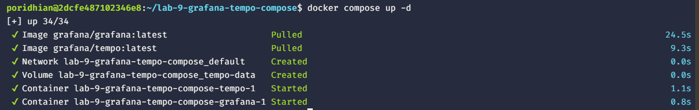
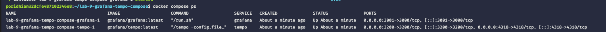
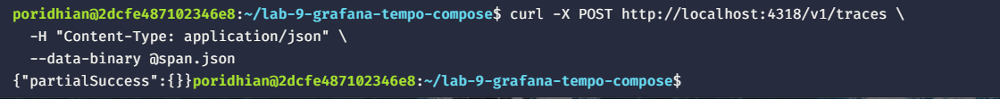
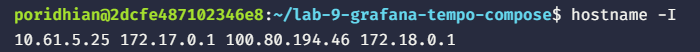
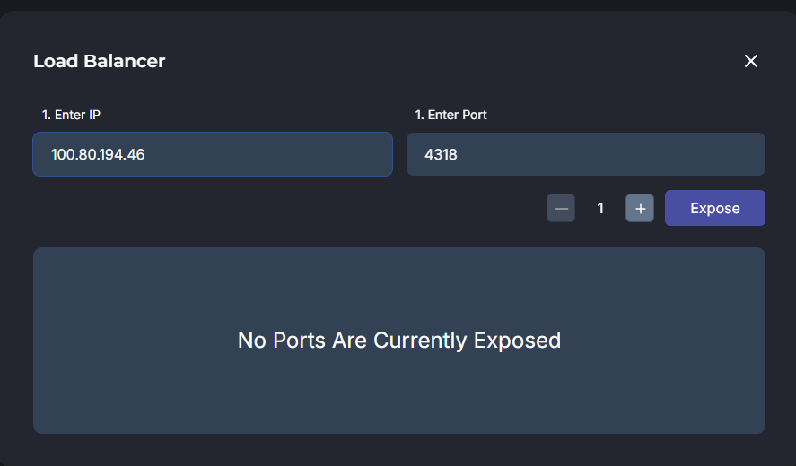
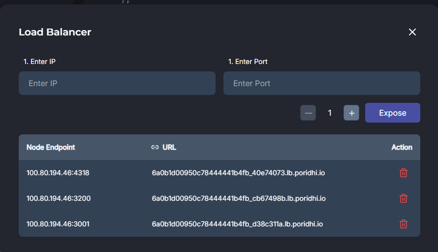

# Lab 9: Deploying Grafana and Tempo with Docker Compose

Deploy a Grafana and Tempo stack with Docker Compose, send a single OTLP span with curl, and find the trace in Grafana Explore.


## What You Will Build

- A `docker-compose.yml` running Grafana on host port 3001 and Tempo on 3200 and 4318.
- A Tempo config that opens an OTLP HTTP receiver.
- A provisioned Grafana datasource pointing at Tempo.
- A single trace queryable in Grafana Explore by trace ID.

## Prerequisites

- Docker Engine with the Compose plugin.
- curl available on the host.
- Ports 3001, 3200, and 4318 free on the host.

## Step 1 — Create the project folder

```bash
mkdir -p lab-9-grafana-tempo-compose/grafana/provisioning/datasources
cd lab-9-grafana-tempo-compose
```

## Step 2 — Write the Compose stack

```bash
cat > docker-compose.yml <<'EOF'
services:
  tempo:
    image: grafana/tempo:latest
    command: ["-config.file=/etc/tempo.yml"]
    volumes:
      - ./tempo.yml:/etc/tempo.yml:ro
      - tempo-data:/var/tempo
    ports:
      - "3200:3200"
      - "4318:4318"

  grafana:
    image: grafana/grafana:latest
    environment:
      - GF_SECURITY_ADMIN_USER=admin
      - GF_SECURITY_ADMIN_PASSWORD=admin
    volumes:
      - ./grafana/provisioning:/etc/grafana/provisioning:ro
    ports:
      - "3001:3000"
    depends_on:
      - tempo

volumes:
  tempo-data:
EOF
```


`tempo` exposes its HTTP query API on 3200 and its OTLP receiver on 4318. `grafana` mounts the provisioning directory so datasources register at startup.

## Step 3 — Configure Tempo

```bash
cat > tempo.yml <<'EOF'
server:
  http_listen_port: 3200

distributor:
  receivers:
    otlp:
      protocols:
        http:
          endpoint: 0.0.0.0:4318

storage:
  trace:
    backend: local
    local:
      path: /var/tempo/traces
    wal:
      path: /var/tempo/wal
EOF
```

The `otlp.protocols.http.endpoint` line opens the OTLP HTTP listener. The `storage.trace` block selects the local backend.

## Step 4 — Provision the Tempo datasource

```bash
cat > grafana/provisioning/datasources/tempo.yaml <<'EOF'
apiVersion: 1

datasources:
  - name: Tempo
    type: tempo
    access: proxy
    url: http://tempo:3200
    isDefault: true
    editable: true
EOF
```

`url: http://tempo:3200` uses the Docker service name, not `localhost`. Grafana reaches Tempo over the internal network.

## Step 5 — Start the stack

```bash
docker compose up -d
```

```bash
docker compose ps
```


Both services should report `running`. If Grafana is missing, check the provisioning YAML for syntax errors.

## Step 6 — Send a test span

```bash
cat > span.json <<'EOF'
{
  "resourceSpans": [
    {
      "resource": {
        "attributes": [
          { "key": "service.name", "value": { "stringValue": "lab-9-test" } }
        ]
      },
      "scopeSpans": [
        {
          "scope": { "name": "lab-9" },
          "spans": [
            {
              "traceId": "4bf92f3577b34da6a3ce929d0e0e4736",
              "spanId": "00f067aa0ba902b7",
              "name": "hello-trace",
              "startTimeUnixNano": "1700000000000000000",
              "endTimeUnixNano": "1700000001000000000"
            }
          ]
        }
      ]
    }
  ]
}
EOF
```
```bash
curl -X POST http://localhost:4318/v1/traces \
  -H "Content-Type: application/json" \
  --data-binary @span.json
```


The response should be HTTP 200 with `{"partialSuccess":{}}`.

## Step 7 — Verify the span landed

```bash
curl http://localhost:3200/api/traces/4bf92f3577b34da6a3ce929d0e0e4736
```


The JSON body includes `traceID=4bf92f3577b34da6a3ce929d0e0e4736` and the `hello-trace` span.

## Step 8 — Find the trace in Grafana

Open `http://localhost:3001`, log in as `admin` / `admin`, click the compass icon for Explore, pick the `Tempo` datasource, switch to **Search**, and paste the trace ID.


The `hello-trace` row appears with its timing bar.

## Checkpoint

- [ ] `docker compose ps` shows both `grafana` and `tempo` running.
- [ ] `curl POST /v1/traces` returns 200 with `{"partialSuccess":{}}`.
- [ ] `curl /api/traces/<id>` returns the `hello-trace` span.
- [ ] Grafana Explore renders the trace under the Tempo datasource.

## Next Steps

Stop the stack with `docker compose down` when you finish. Lab 10 instruments a Flask API with OpenTelemetry and exports its spans to the same Tempo receiver.