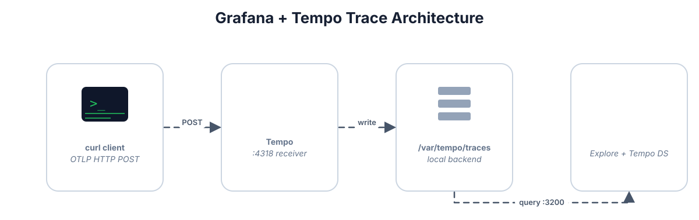
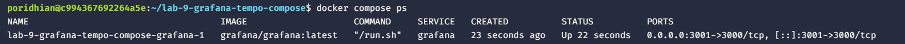
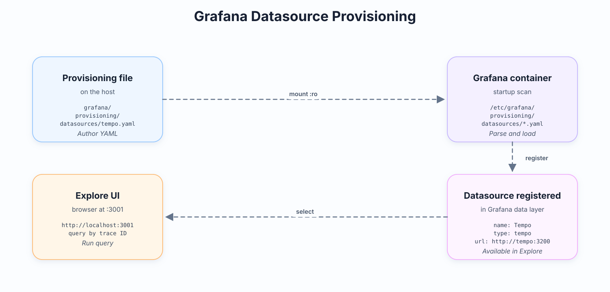
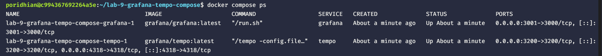

# Lab 9: Deploying Grafana and Tempo with Docker Compose

**Module 55 | Observability & Distributed Tracing**

## Introduction

Distributed tracing captures the path of a request as it moves across services. Each unit of work is recorded as a span, and related spans are grouped into a trace. Without a tracing backend, these spans disappear as soon as the process exits.

Tempo is a high-volume tracing backend developed by Grafana Labs. It ingests spans over the OpenTelemetry Protocol (OTLP) and stores them locally with minimal configuration. Grafana acts as the visualization layer, querying Tempo to render trace timelines.

This lab deploys Grafana and Tempo together using Docker Compose. You will configure the OTLP receiver, provision the Tempo datasource in Grafana, send a test span with curl, and locate the resulting trace in Grafana Explore.

## Learning Objectives

By the end of this lab you will be able to:

- Deploy a two-service Docker Compose stack running Grafana and Tempo.
- Configure Tempo to accept OTLP HTTP spans on port 4318.
- Provision a Grafana datasource pointing to Tempo at startup.
- Send a valid OTLP span payload using curl with the correct Content-Type header.
- Query a trace by trace ID in Grafana Explore and verify the span landed in Tempo.

## Task Description

In this lab, the stack is stood up, the Tempo datasource is provisioned, a single OTLP span is sent with curl, and the resulting trace is located in Grafana Explore.

<p align="center"></p>

## Table of Contents

1. Chapter 1: Write the Docker Compose Stack
2. Chapter 2: Configure Tempo as a Grafana Datasource
3. Chapter 3: Send a Trace and Verify in Grafana

## Architecture

You join the platform team at a mid-sized SaaS company that has just begun instrumenting its microservices. The first service is ready, but the team has no backend to receive spans and no dashboard to view them.

Your task is to stand up a minimal tracing stack on a single host. You will use Grafana Tempo as the tracing backend and Grafana as the query interface. You must verify the pipeline end-to-end by sending a single test span with curl and observing it appear in Grafana.

## Prerequisites

- Familiarity with Docker and Docker Compose syntax.
- A working Docker Engine installation with the Compose plugin.
- Basic understanding of YAML configuration files.
- Basic understanding of HTTP request methods and headers.

## Environment Setup

Open a terminal on a Linux, macOS, or Windows host with Docker Engine and the Compose plugin installed. Use any text editor or Markdown viewer to read this file side by side.

All commands below assume you start from the directory in which you want the lab to live. Create the lab folder structure and change into it. Every later `docker compose` command must run from this folder.

```bash
mkdir -p lab-9-grafana-tempo-compose/grafana/provisioning/datasources
cd lab-9-grafana-tempo-compose
```

Confirm you are in the right place before going further.

```bash
pwd
ls -la
```

The output must end in `/lab-9-grafana-tempo-compose` and show the `grafana/` directory you just created.

Verify Docker and the Compose plugin are installed.

```bash
docker --version
docker compose version
```

Create an empty file for the Tempo configuration.

```bash
touch tempo.yml
```

## Chapter 1: Write the Docker Compose Stack

### Opening Context

Docker Compose lets you define multi-container applications in a single declarative file. Each service maps to one container, and port mappings expose container ports to the host. For Grafana and Tempo to communicate, they must share a network and reference each other by service name.

The two services you deploy have different roles. Tempo listens on port 3200 for HTTP queries and 4318 for OTLP ingestion. Grafana listens on port 3000 for the web UI. Grafana will reach Tempo over the internal Docker network using the hostname `tempo`.

### What You Will Build

You will create a `docker-compose.yml` file that defines the grafana and tempo services, exposes their ports to the host, and mounts configuration files into the containers.

### Implementation

Create `docker-compose.yml` with the following content. Run this heredoc from inside `lab-9-grafana-tempo-compose/`. The single quotes around `'EOF'` stop the shell from expanding any characters, so the YAML lands in the file exactly as shown.

```bash
cat > docker-compose.yml <<'EOF'
services:
  tempo:
    image: grafana/tempo:latest
    command: ["-config.file=/etc/tempo.yml"]
    volumes:
      - ./tempo.yml:/etc/tempo.yml:ro
      - tempo-data:/var/tempo
    ports:
      - "3200:3200"
      - "4318:4318"

  grafana:
    image: grafana/grafana:latest
    environment:
      - GF_SECURITY_ADMIN_USER=admin
      - GF_SECURITY_ADMIN_PASSWORD=admin
    volumes:
      - ./grafana/provisioning:/etc/grafana/provisioning:ro
    ports:
      - "3001:3000"
    depends_on:
      - tempo

volumes:
  tempo-data:
EOF
```

Confirm the file was written correctly.

```bash
cat docker-compose.yml
```

The output must show `4318:4318` on the host-to-container port mapping line.

The `tempo` service mounts `tempo.yml` read-only into the container at `/etc/tempo.yml`. The `command` flag tells the Tempo binary to load that file at startup. The named volume `tempo-data` persists spans across container restarts.

The `grafana` service mounts the provisioning directory. Grafana reads any YAML files under `/etc/grafana/provisioning/datasources/` on startup and registers them automatically. The `depends_on` directive ensures Tempo starts before Grafana, though it does not wait for Tempo to be ready.

### Test and Verify

Start the stack in detached mode. The command must run from `lab-9-grafana-tempo-compose/`.

```bash
docker compose up -d
```

Check that both containers report a running state.

```bash
docker compose ps
```

The output should list both `grafana` and `tempo` with state `running`. If you see `no configuration file provided: not found`, you are not inside the lab directory — run `cd lab-9-grafana-tempo-compose` and retry.

### Checkpoint

- [ ] `docker compose ps` lists both `grafana` and `tempo` in state `running`.

### Screenshot

> *Drop your screenshot at `./images/lab-9-ch1-docker-compose-ps.png`.*

<p align="center">3000/tcp and tempo-1 running on 0.0.0.0:3200->3200/tcp and 0.0.0.0:4318->4318/tcp"></p>

## Chapter 2: Configure Tempo as a Grafana Datasource

### Opening Context

Tempo needs two configuration pieces. First, its own `tempo.yml` must enable the OTLP receiver and declare a local storage backend. Second, Grafana must learn that Tempo exists as a queryable datasource. Provisioning files inside Grafana's configuration directory register datasources automatically on startup, removing the need to click through the UI.

### What You Will Build

You will write a Tempo configuration file with an OTLP receiver block, and a Grafana provisioning file that declares Tempo as a datasource of type `tempo` pointing at `http://tempo:3200`.

<p align="center"></p>

### Implementation

Write `tempo.yml` with the following content. Run the heredoc from inside `lab-9-grafana-tempo-compose/`.

```bash
cat > tempo.yml <<'EOF'
server:
  http_listen_port: 3200

distributor:
  receivers:
    otlp:
      protocols:
        http:
          endpoint: 0.0.0.0:4318

storage:
  trace:
    backend: local
    local:
      path: /var/tempo/traces
    wal:
      path: /var/tempo/wal
EOF
```

Write `grafana/provisioning/datasources/tempo.yaml` with the following content. Run the heredoc from inside `lab-9-grafana-tempo-compose/`.

```bash
cat > grafana/provisioning/datasources/tempo.yaml <<'EOF'
apiVersion: 1

datasources:
  - name: Tempo
    type: tempo
    access: proxy
    url: http://tempo:3200
    isDefault: true
    editable: true
EOF
```

Confirm both files are correct:

```bash
cat tempo.yml
cat grafana/provisioning/datasources/tempo.yaml
```

`tempo.yml` must show the OTLP HTTP endpoint `0.0.0.0:4318`. `tempo.yaml` must show `type: tempo` and `url: http://tempo:3200`. Grafana references Tempo by service name, not by `localhost`, because `localhost` inside a container is the container itself.

The `server.http_listen_port` setting tells Tempo which port serves its HTTP query API. The `distributor.receivers.otlp.protocols.http.endpoint` line opens the OTLP HTTP listener on all interfaces at port 4318. The `storage.trace` block selects the `local` backend and points it at two directories inside the container for traces and the write-ahead log.

In the Grafana provisioning file, `apiVersion: 1` is the provisioning schema version. The `access: proxy` mode instructs Grafana to forward queries to Tempo from the server side rather than the browser. The `isDefault: true` flag makes Tempo the default datasource for new panels.

### Test and Verify

Restart the stack so Tempo picks up its config and Grafana reads the provisioning file. Both commands must run from `lab-9-grafana-tempo-compose/`.

```bash
docker compose down
docker compose up -d
```

Tail the logs from both services to confirm clean startup.

```bash
docker compose logs tempo | head -20
docker compose logs grafana | head -40
```

**If only `tempo-1` shows up in `docker compose ps` and Grafana is missing**, Grafana crashed during startup. The most common cause is a malformed provisioning YAML. Check the exit reason:

```bash
docker compose ps -a
docker inspect lab-9-grafana-tempo-compose-grafana-1 --format '{{.State.Status}} {{.State.Error}}'
docker compose logs grafana
```

The error message usually points at a YAML parse error in `grafana/provisioning/datasources/tempo.yaml` — re-check that file's contents:

```bash
cat grafana/provisioning/datasources/tempo.yaml
```

It must contain exactly:

```yaml
apiVersion: 1

datasources:
  - name: Tempo
    type: tempo
    access: proxy
    url: http://tempo:3200
    isDefault: true
    editable: true
```

If the file is correct but Grafana still exits, check whether port 3001 is already in use on the host:

```bash
sudo ss -ltnp | grep :3001
```

Anything listening on port 3001 will prevent Grafana from binding. Stop the conflicting process or change the host-side port mapping in `docker-compose.yml` from `"3001:3000"` to e.g. `"3002:3000"` and visit `http://localhost:3002`.

### Checkpoint

- [ ] `docker compose ps` shows both `tempo-1` and `grafana-1` in state `running`.

### Screenshot

> *Drop your screenshot at `./images/lab-9-ch2-docker-logs.png`.*

<p align="center"></p>

## Chapter 3: Send a Trace and Verify in Grafana

### Opening Context

With the stack running and datasources provisioned, the pipeline is ready. The OTLP HTTP protocol expects a JSON payload describing resource spans. Each resource span carries one or more spans, and each span carries a trace ID, span ID, and timing data.

The curl command sends this payload directly to Tempo's OTLP endpoint. If Tempo accepts the payload, the trace becomes queryable in Grafana Explore by its trace ID.

### What You Will Build

You will send a single OTLP span using curl, capture the resulting trace ID, and locate the trace in Grafana Explore using the Tempo datasource.

### Implementation

Create a file named `span.json` containing a single OTLP span.

```bash
cat > span.json <<'EOF'
{
  "resourceSpans": [
    {
      "resource": {
        "attributes": [
          {
            "key": "service.name",
            "value": { "stringValue": "lab-9-test" }
          }
        ]
      },
      "scopeSpans": [
        {
          "scope": { "name": "lab-9" },
          "spans": [
            {
              "traceId": "4bf92f3577b34da6a3ce929d0e0e4736",
              "spanId": "00f067aa0ba902b7",
              "name": "hello-trace",
              "startTimeUnixNano": "1700000000000000000",
              "endTimeUnixNano": "1700000001000000000"
            }
          ]
        }
      ]
    }
  ]
}
EOF
```

Send the span with curl.

```bash
curl -X POST http://localhost:4318/v1/traces \
  -H "Content-Type: application/json" \
  --data-binary @span.json
```

The `Content-Type: application/json` header is required. Tempo parses the body as JSON; without it the receiver returns 415 Unsupported Media Type.

The `resourceSpans` array is the top-level OTLP envelope. Each entry contains a `resource` with attributes describing the producing service, and a `scopeSpans` array containing actual spans. The `traceId` is a 16-byte hex string that uniquely identifies the trace, while `spanId` is an 8-byte hex string that identifies one span within it. Timestamps are expressed in nanoseconds since the Unix epoch.

Curl's `--data-binary` flag preserves the exact bytes of the file, unlike `-d` which can interpret special characters.

### Test and Verify

After sending the span, retrieve it from Tempo using the trace-by-id API:

```bash
curl http://localhost:3200/api/traces/4bf92f3577b34da6a3ce929d0e0e4736
```

The response is a JSON envelope containing `{"traceID":"4bf92f3577b34da6a3ce929d0e0e4736"}` and the full span set. Any non-error response (HTTP 200) confirms Tempo accepted the span.

To search by service name across all stored traces, use the TraceQL endpoint. The older `?query=` text search was removed in Tempo 3.x; the modern equivalent is:

```bash
curl -G http://localhost:3200/api/search \
  --data-urlencode 'q={ resource.service.name = "lab-9-test" }' \
  -H 'Accept: application/json'
```

The response lists matching traces with their trace IDs and metadata. `{ resource.service.name = "..." }` is a TraceQL filter — same syntax used in Grafana's TraceQL query field.

Open a browser to http://localhost:3001 and log in with `admin` / `admin`. Click the compass icon on the left to open Explore. Choose the `Tempo` datasource from the dropdown. Switch the query type to **Search** and enter the trace ID `4bf92f3577b34da6a3ce929d0e0e4736`. Click `Run query`. The trace `hello-trace` should appear with its timing bar.

### Checkpoint

- [ ] Grafana Explore shows the `hello-trace` span under the Tempo datasource.

### Screenshots

> *Drop your screenshots at `./images/lab-9-ch3-curl-traces.png`, `./images/lab-9-ch3-tempo-search.png`, and `./images/lab-9-ch3-grafana-explore.png`.*

<p align="center"></p>

<p align="center"></p>

<p align="center"></p>

### Experiment

Send the same endpoint with a malformed body and confirm Tempo rejects it.

```bash
cat > span-broken.json <<'EOF'
{ "invalid": "payload" }
EOF

curl -X POST http://localhost:4318/v1/traces \
  -H "Content-Type: application/json" \
  --data-binary @span-broken.json -i
```

The response should be `HTTP/1.1 400 Bad Request`. Tempo validates the JSON envelope and rejects payloads that lack the required `resourceSpans` array. No trace is stored.

To confirm no trace was created, query the trace-by-id endpoint using a random hex string — Tempo returns 404.

```bash
curl -i http://localhost:3200/api/traces/00000000000000000000000000000001
```

## Conclusion

You deployed a minimal Grafana and Tempo stack on a single host using Docker Compose. You configured Tempo to accept OTLP HTTP spans on port 4318 and to store them in a local backend. You provisioned the Tempo datasource in Grafana through a YAML file, ensuring the datasource appears automatically on every startup.

You then sent a single test span with curl, captured the trace ID, and verified the trace in Grafana Explore. The malformed payload experiment demonstrated that Tempo validates incoming JSON and rejects ill-formed requests with a 400 status.

This lab covered only the ingestion and query path. You did not configure retention, scaling, or trace sampling. The next lab in this module instruments a sample application with the OpenTelemetry SDK so spans are generated automatically rather than by hand-crafted curl calls.